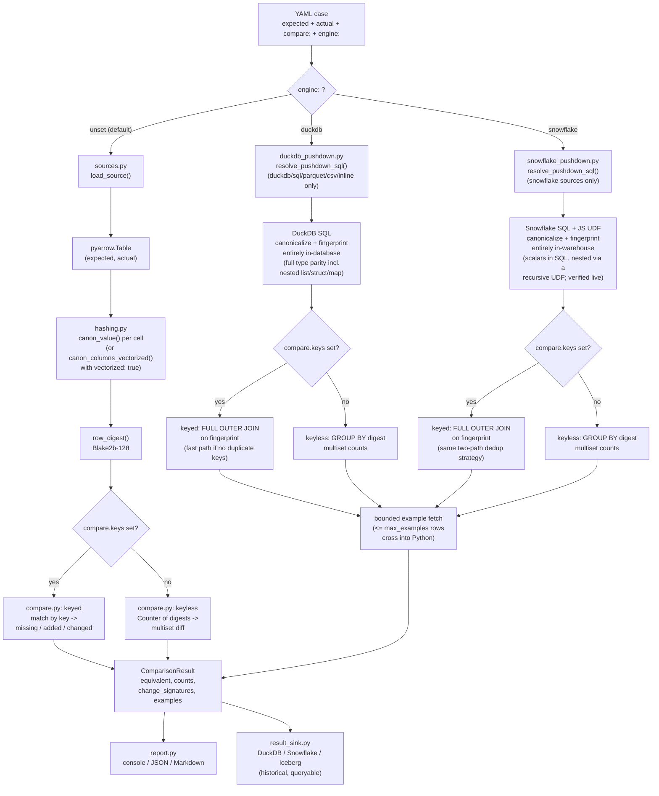
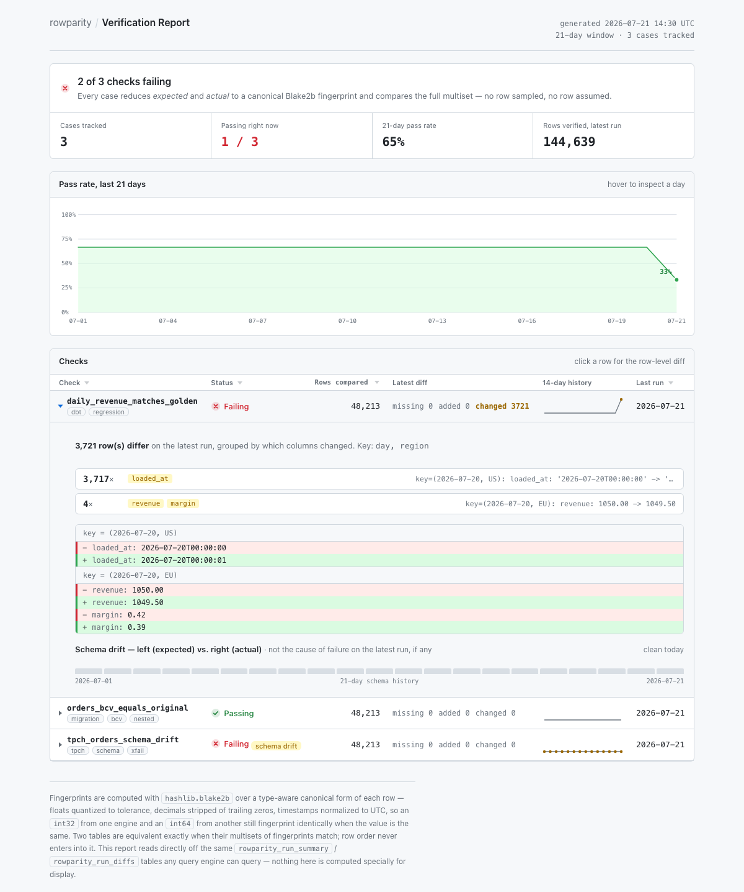

# rowparity Feature Reference

A complete usage manual covering every feature, option, and source type — with worked examples built on public datasets that run with no cloud account.

---

## Quick Start

**What it does:** compares two tables — any mix of Snowflake, Trino, Spark, DuckDB, Parquet, CSV, Iceberg, Delta, or inline YAML rows — by fingerprinting every row. Row order, column order, and cross-engine type differences (`int32` vs `int64`, `NUMBER` vs `bigint`) never matter. It reports exactly what is missing, added, or changed.

### What this solves

Every data team eventually needs to prove two tables are equivalent, and usually reaches for a one-off `EXCEPT` query or a spreadsheet export. That approach breaks down quickly:

- **dbt model regressions go unnoticed** — a refactor quietly changes model output, and there is no repeatable "does this still match the golden output" check wired into CI, so it surfaces as a stakeholder complaint instead of a failed build.
- **Migration validation needs real proof, not a spot-check** — moving a table between engines or formats (Redshift → Snowflake, Hive → Iceberg, normalized → denormalized) requires showing the migrated data is *equivalent*, at full scale, on every run — not "looked right in a sample."
- **Cross-engine type noise drowns real diffs** — naive `EXCEPT`/`MINUS` queries throw false positives from `int32` vs `int64`, `NUMBER` vs `DOUBLE`, trailing decimal zeros, or naive vs. timezone-aware timestamps, burying the diffs that actually matter.
- **Row order is not guaranteed** — distributed engines make no promises about row order; a comparison that assumes otherwise produces flaky, order-dependent false positives.
- **Ad-hoc comparison scripts do not scale or survive reuse** — thrown together once, they rarely handle nested types correctly, and hit a wall well before real warehouse-sized tables.

rowparity turns "prove these two tables are the same" into a declarative YAML assertion — engine-agnostic, type-aware, CI-native — instead of a new hand-rolled script every time.

**Install and run in under a minute:**

```bash
pip install rowparity[duckdb]      # core + DuckDB (sufficient for local CI)
```

All heavy drivers are optional extras — install only what your sources need:

| Extra | Command | Enables |
|---|---|---|
| `duckdb` | `pip install rowparity[duckdb]` | `duckdb`/`sql`/`parquet`/`csv`/`arrow`/`inline` sources + `engine: duckdb` |
| `snowflake` | `pip install rowparity[snowflake]` | `snowflake` source + `engine: snowflake` |
| `trino` | `pip install rowparity[trino]` | `trino` source + `engine: trino` |
| `iceberg` | `pip install rowparity[iceberg]` | `iceberg` source |
| `delta` | `pip install rowparity[delta]` | `delta` source |
| `spark` | manage `pyspark` yourself | `spark` source (not in extras — avoids forcing a JVM dependency) |
| `all` | `pip install rowparity[all]` | Everything above except `spark` |

The base package (`pyarrow` + `PyYAML`) is always installed. A missing driver raises a clear error at case-run time with the exact install command, so you only pay for what you actually use.

```yaml
# case.yaml — keyed: reports missing / added / changed per key
name: quick_check
expected:
  type: inline
  rows: [{id: 1, amount: 100.0}, {id: 2, amount: 200.0}]
actual:
  type: inline
  rows: [{id: 1, amount: 100.0}, {id: 2, amount: 201.0}]
compare:
  keys: [id]
```

```yaml
# case.yaml — keyless: omit keys entirely for multiset comparison
# Use when there's no reliable business key (BCV, full-refresh dimensions, event tables)
name: quick_check_keyless
expected:
  type: inline
  rows: [{region: "US", revenue: 100.0}, {region: "EU", revenue: 200.0}]
actual:
  type: inline
  rows: [{region: "EU", revenue: 200.0}, {region: "US", revenue: 100.0}]  # row order doesn't matter
```

```bash
rowparity run case.yaml
```

```
Case 'quick_check': [DIFFERENT] keyed on ['id'] | expected=2 actual=2 | missing=0 added=0 changed=1
  first 1 difference(s):
  ~ CHANGED key=(2): amount: 200.0 -> 201.0
Summary: 0/1 equivalent, 1 failing
```

A non-zero exit code on a diff constitutes the entire CI contract.

**Cheat sheet — quick reference by task:**

| I want to... | Do this | Details |
|---|---|---|
| Compare rows with a stable business key | `compare: {keys: [my_id]}` | §1 |
| Compare rows with no reliable key (BCV, full refresh) | Omit `keys` entirely | §1 |
| Ignore volatile columns like `loaded_at` | `ignore_columns: [loaded_at]` | §4 |
| Allow tiny float differences | `float_tolerance: 0.001` | §4 |
| Compare Snowflake `NUMBER`/decimal against Spark/Python numerics | `coerce_numeric_to_float: true` | §4 |
| Handle inconsistent string casing / padding | `trim_strings: true`, `case_insensitive: true` | §4 |
| Catch schema drift (new/dropped/retyped columns) | `strict_columns: true` | §4 |
| Speed up a big table on the default engine | `vectorized: true` | §4 |
| Compare tables in the tens/hundreds of millions of rows | `engine: duckdb` (needs DuckDB-reachable sources: `duckdb`/`sql`/`parquet`/`csv`/`inline`) | §3 |
| Compare two large tables that already live in Snowflake, no export step | `engine: snowflake` (scalars + nested types, verified against a live warehouse — see §3) | §3 |
| Compare two large tables that already live in Trino, no export step | `engine: trino` (both sides must be `type: trino` — see §3) | §3 |
| Put a long SQL query in a file instead of embedding it in the YAML | `query_file: sqls/my_query.sql` (path relative to the case YAML — see §2) | §2 |
| Check two tables agree on column names and types, without fetching any rows | `schema_check:` instead of `expected`/`actual` | §13 |
| Map Looker/report usage columns to their source table columns, find gaps | `schemaparity coverage case.yaml` with `coverage_check:` | §14 |
| Wire cases into pytest | `discover_cases()` + `assert_case()` | §6 |

Everything past this point is the full reference. Continue reading when the cheat sheet is not sufficient, or proceed to the [Table of Contents](#table-of-contents) below.

---

## Table of Contents

1. [Core Concepts](#1-core-concepts)
2. [Source Types](#2-source-types)
3. [Push-Down Engines](#3-push-down-engines)
4. [Compare Options](#4-compare-options)
5. [CLI Reference](#5-cli-reference)
6. [Pytest Integration](#6-pytest-integration)
7. [Reporting](#7-reporting)
8. [Fingerprint Sink](#8-fingerprint-sink-upcoming)
9. [Result Sink](#9-result-sink)
10. [HTML Report](#10-html-report)
11. [Public Dataset Examples](#11-public-dataset-examples)
12. [Concept Check](#12-concept-check)
13. [Schema Check](#13-schema-check)
14. [Coverage Mapping](#14-coverage-mapping)
15. [Appendix — Algorithmic Foundations](#appendix--algorithmic-foundations)

---


## 1. Core Concepts

### How comparison works

rowparity reduces every row to a **canonical fingerprint** — a stable hash of a type-aware normalized form. Two tables are equivalent when their **multisets of fingerprints match**. This means:

- Row order never matters.
- Column order never matters.
- The same logical value from two different engines (Snowflake `NUMBER(38,0)` vs Spark `bigint` vs a Python `int`) produces the same fingerprint.

### Keyed vs keyless mode

| Mode | When to use | Controlled by |
|------|-------------|---------------|
| **Keyed** | Rows have a stable, unique business key | `keys: [col, ...]` in `compare:` |
| **Keyless** | No reliable key, or validating a full-refresh / BCV | Omit `keys` entirely |

**Keyed** reports: `missing` (key in expected, absent from actual), `added` (key in actual, absent from expected), `changed` (same key, different row content — with per-column detail).

**Keyless** reports: rows that appear more/fewer times than expected, without pinning to a key.

#### How to choose the right mode

Use this decision table — when in doubt, prefer **keyless**:

| Table type | Recommended mode | Example `keys:` |
|---|---|---|
| Fact table with surrogate key | keyed | `[fact_id]` |
| Aggregate model with composite business key | keyed | `[date, region]` |
| Dimension table (full refresh, no enforced PK) | keyless | — |
| Event / log table | keyless | — |
| BCV / migration validation | keyless | — |
| Any table where the correct mode is unclear | keyless | — |

#### Common mistake: using all columns as the key

Most data warehouse tables do not enforce primary key constraints. Listing every column in `keys:` to compensate is **not recommended** — this approach is worse than keyless:

- A row where one value changed appears as **`missing` + `added`** (the old key combination vanished, a new one appeared). You lose the per-column diff detail that makes keyed mode useful.
- Duplicate rows cause **duplicate key warnings** because two rows with identical values look like a key collision.

Keyless handles both cases correctly and is the right choice whenever there is no single column (or small composite) that uniquely identifies a row.

#### Synthetic keys for better diagnostics

To obtain keyed-style diffs on a table without a natural key, build a synthetic key in the SQL query itself:

```yaml
actual:
  type: snowflake
  query: >
    SELECT concat(order_date, '-', region) AS _row_key,
           revenue, units
    FROM fact_daily_revenue

compare:
  keys: [_row_key]     # synthetic key, not enforced in the warehouse
```

This gives per-row `changed` diffs without requiring a primary key constraint.

### Walkthrough — how a comparison actually runs

Conceptually, this reduces the comparison problem to comparing two sets of fixed-size digests rather than comparing rows individually: each row is reduced to a short code that captures everything about it, and the comparison operates on the *multisets of codes*. If the multisets match, the underlying row sets are equivalent, regardless of the order in which the rows were produced.

Applied to table rows, this proceeds in the following steps:

1. **Load** — get `expected` and `actual` into a form the comparison engine can read (either a `pyarrow.Table` in Python, or, for the DuckDB push-down engine, a SQL query DuckDB can run directly — see §3).
2. **Agree on which columns matter** — take the columns present on both sides, drop anything in `ignore_columns`, keep only `select` if given, and sort the rest alphabetically. Sorting matters because it means column order in the source can never change the result.
3. **Canonicalize each value** — every cell is normalized using its *type*, not its raw representation: floats are rounded onto a tolerance grid, decimals have trailing zeros stripped, timestamps are shifted to UTC, and `NULL` becomes a distinct sentinel that never equals anything else. This is what makes an `int32` from one engine equal an `int64` from another, or `09:00 EST` equal `14:00 UTC` — both normalize to the identical canonical form.
4. **Fingerprint the row** — the canonicalized values for a row are combined and hashed (Blake2b) into one short, fixed-size digest. Two rows that mean the same thing produce the identical digest, regardless of which engine produced them or the order in which the columns appeared.
5. **Compare digests, not rows** — this is the payoff of steps 1-4: the actual comparison never re-examines raw values; it compares digests directly.
   - **Keyed**: group each side's digests by business key. A key present on only one side is `missing`/`added`; a key present on both sides with different digests is `changed` (only then does rowparity go back and diff the actual column values, to build a human-readable explanation).
   - **Keyless**: count how many times each digest occurs on each side (a multiset). A digest that occurs more on one side than the other indicates that many copies of that row are missing or added — this is what allows row order, and even duplicate rows, to be handled correctly with no additional effort.
6. **Report** — the result (equivalent or not, with counts and example diffs) goes to the console, and optionally to JSON/Markdown files and a queryable result sink.



All three paths produce the exact same `ComparisonResult` shape — `engine:` changes *how* the fingerprinting and comparison run (in-database, in-warehouse, or in-Python), never *what* the comparison means. This design is intentional: it allows a single YAML field to move a case from "runs fine locally" to "runs at 100M rows" without rewriting the case.

### Algorithm — the precise steps

This section provides the exact step-by-step detail summarized by the diagram above: the comparison runs in four steps. Steps 1–3 are identical for both sides; step 4 is where the actual diff happens.

```
Step 1 — Load
  expected source  ──►  pyarrow.Table
  actual source    ──►  pyarrow.Table

Step 2 — Resolve columns
  intersection(expected.columns, actual.columns)
    minus ignore_columns
    intersect select  (if given)
  → sorted_cols   (alphabetical, so column order never affects the hash)

Step 3 — Fingerprint every row
  for each row:
    canon_row(schema, row, sorted_cols, config)
      for each col in sorted_cols:
        canon_value(arrow_type, value)   ← type-aware normalization (see rules below)
      → canonical tuple  e.g. (("day","D","2024-01-01"), ("revenue","f",1500500), ...)
    row_digest(canonical_tuple)
      → Blake2b-128(repr(tuple))         ← 16-byte stable fingerprint

Step 4a — Keyless comparison
  expected_counts = Counter { digest → n }   (one pass over expected rows)
  actual_counts   = Counter { digest → n }   (one pass over actual rows)
  for each digest in union(expected_counts, actual_counts):
    delta = expected_counts[digest] - actual_counts[digest]
    delta > 0  →  missing rows (in expected, absent from actual)
    delta < 0  →  added rows   (in actual, absent from expected)

Step 4b — Keyed comparison
  expected_index = { canon_key → row }   (grouped by key columns)
  actual_index   = { canon_key → row }
  keys in expected only  →  missing
  keys in actual only    →  added
  keys in both:
    compare row_digest(expected_row) vs row_digest(actual_row)
    if differ  →  changed  (column-level diff computed on demand)
```

The central property is that **fingerprints absorb all engine and format differences** before comparison. Two tables produced by completely different engines need only agree on *logical value*, not wire type, byte order, or row order.

### Canonicalization rules (the invariants)

| Type | Rule |
|------|------|
| `list` / `array` | **Ordered** — element sequence matters |
| `struct` | **Unordered** — field order irrelevant, sorted by name before hashing |
| `map` | **Unordered** — key order irrelevant, pairs sorted before hashing |
| `float` | Quantized to `float_tolerance` grid: `bucket = round(value / tol)` |
| `decimal` | Trailing zeros stripped (`1.10 ≡ 1.1`), compared exactly |
| `timestamp` | Normalized to UTC before hashing (`09:00 EST ≡ 14:00 UTC`) |
| `int32` vs `int64` | Same logical integer value → same fingerprint |
| `NULL` | Distinct sentinel; `NULL ≠ "" ≠ 0 ≠ {}` |

---

## 2. Source Types

Every source is described by a dict with a `type` key and returns a `pyarrow.Table`. Expected and actual may use different source types in the same case.

### `inline`

Rows written directly in the YAML. Use for small expected fixtures. Optionally add `schema:` to force exact types (prevents Arrow inference from choosing `int64` vs `float64`).

```yaml
expected:
  type: inline
  rows:
    - {order_id: 1, amount: 99.99, status: "complete"}
    - {order_id: 2, amount: 14.50, status: "pending"}
```

With explicit schema:
```yaml
expected:
  type: inline
  schema:
    order_id: int32
    amount: decimal128(10,2)
    status: string
  rows:
    - {order_id: 1, amount: "99.99", status: "complete"}
```

Supported schema types: `int`, `int32`, `int64`, `float`, `double`, `float32`, `str`, `string`, `bool`, `date`, `timestamp`, `timestamptz`, `decimal128(p,s)`, `list<type>`.

### `csv`

```yaml
expected:
  type: csv
  path: ../data/customers_snapshot.csv   # relative to the YAML file
```

Uses PyArrow's CSV reader; types are inferred.

### `parquet`

Supports single files and glob patterns (multiple files are concatenated).

```yaml
expected:
  type: parquet
  path: ../data/orders_2024_*.parquet    # glob OK
```

### `arrow` / `feather`

```yaml
expected:
  type: arrow
  path: ../data/snapshot.arrow
```

`feather` is an alias for `arrow`.

### `duckdb` / `sql`

Runs a SQL query against a DuckDB database. `sql` is an alias. Use `:memory:` for an in-memory database (useful with `setup:` statements to load parquet/iceberg inline).

```yaml
actual:
  type: duckdb
  database: ../data/warehouse.duckdb
  read_only: true
  query: SELECT order_id, customer_id, total FROM orders WHERE status = 'complete'
```

With setup statements (e.g., create a view over parquet):
```yaml
actual:
  type: duckdb
  database: ":memory:"
  setup:
    - "CREATE VIEW orders AS SELECT * FROM read_parquet('../data/orders/*.parquet')"
  query: SELECT order_id, total FROM orders
```

Or use `table:` as a shorthand for `SELECT * FROM <table>`:
```yaml
actual:
  type: duckdb
  database: ../data/warehouse.duckdb
  table: daily_revenue
```

### `query_file:` — SQL from an external file

Any source type that accepts a `query:` field also accepts `query_file:` — a path to a `.sql` file resolved relative to the YAML case file. Use this when a query is too large to read comfortably inline, or when the same SQL is shared across multiple cases.

```yaml
actual:
  type: trino
  query_file: sqls/actual_revenue.sql    # relative to this YAML file
```

`query:` and `query_file:` are mutually exclusive — if both are present, `query:` wins. Works with `duckdb`, `sql`, `snowflake`, `trino`, and any other query-based source type. The file's contents are read once at case load time and treated exactly like an inline `query:` string.

### `snowflake`

**Key-pair auth only** — password auth is not supported anywhere rowparity talks to Snowflake (see `snowflake_auth.py`). Non-secret connection settings are pulled from environment variables and can also be overridden directly in `connection:`; the private key itself is never accepted inline in YAML.

```yaml
actual:
  type: snowflake
  query: SELECT order_id, customer_id, total FROM PROD.ORDERS.FACT_ORDERS
```

Environment variables: `SNOWFLAKE_ACCOUNT`, `SNOWFLAKE_USER`, `SNOWFLAKE_ROLE`, `SNOWFLAKE_WAREHOUSE`, `SNOWFLAKE_DATABASE`, `SNOWFLAKE_SCHEMA`, plus one of `SNOWFLAKE_PRIVATE_KEY_PATH` (a PEM file path) or `SNOWFLAKE_PRIVATE_KEY` (raw PEM text, e.g. a CI secret) for the private key, and an optional `SNOWFLAKE_PRIVATE_KEY_PASSPHRASE` if it is encrypted.

With explicit connection (for per-case overrides):
```yaml
actual:
  type: snowflake
  connection:
    database: STAGING
    schema: QA
    private_key_path: /secrets/rsa_key.p8   # optional per-case override; still just a path
  query: SELECT * FROM orders
```

Install: `pip install rowparity[snowflake]`

**Scale note:** like the plain `spark` source above, this materializes the full result to the driver — suitable for small-to-medium results, not full-table migration checks. For large Snowflake tables, use `engine: snowflake` (§3) instead, which canonicalizes and fingerprints entirely in-warehouse — no export step required, but scalars only for now.

### `iceberg`

Reads an Iceberg table via pyiceberg. Catalog is configured via `~/.pyiceberg.yaml` or passed inline.

```yaml
actual:
  type: iceberg
  catalog: glue                         # catalog name from ~/.pyiceberg.yaml
  table: prod.orders.fact_orders
  row_filter: "order_date >= '2024-01-01'"   # optional pushdown filter
  columns: [order_id, customer_id, total]    # optional column selection
```

Install: `pip install rowparity[iceberg]`

### `delta`

Reads a Delta Lake table directly via `delta-rs` — no Spark or JVM required. Works with local paths, S3, GCS, and ADLS. Unity Catalog tables are Delta tables under the hood and work identically.

```yaml
actual:
  type: delta
  path: s3://my-bucket/prod/orders          # local path or cloud URI
  storage_options:
    AWS_REGION: us-east-1                   # cloud credentials
    AWS_ACCESS_KEY_ID: "..."
    AWS_SECRET_ACCESS_KEY: "..."
  columns: [order_id, customer_id, total]   # optional column projection
  filters: [["order_date", ">=", "2024-01-01"]]  # optional partition/row filter
```

Time-travel (read a specific snapshot):
```yaml
actual:
  type: delta
  path: s3://my-bucket/prod/orders
  version: 42              # specific Delta version number
  # or:
  timestamp: "2024-06-01T00:00:00Z"
```

Install: `pip install rowparity[delta]`

### `spark`

Runs a SQL query against a live `SparkSession` and collects the result to Arrow via PySpark's built-in Arrow bridge (`spark.sql.execution.arrow.pyspark.enabled`). The session is obtained via `SparkSession.builder.getOrCreate()` — configure it before calling `rowparity`.

```yaml
actual:
  type: spark
  query: SELECT order_id, customer_id, total FROM prod_catalog.orders
  columns: [order_id, total]    # optional: project before collection
```

Or use `table:` shorthand:
```yaml
actual:
  type: spark
  table: prod_catalog.orders
```

**Scale note:** This collects the full result set to the driver — suitable for small-to-medium results (e.g. small aggregate reconciliations), not for full-table migration checks. For large tables, land the Spark result as Parquet and read it via the `duckdb`/`parquet` source instead, then use `engine: duckdb` (§3) for the comparison itself; direct Spark push-down is not supported (see §3's "What sources it can reach"). A large table that lives in *Snowflake* rather than Spark can instead use `engine: snowflake` (§3) directly, with no export step required — scalars only for now.

**Type mapping:** Spark's `ArrayType`, `StructType`, and `MapType` convert naturally to Arrow `list`, `struct`, and `map` — rowparity's canonicalization rules apply without any special configuration.

Install: manage `pyspark` in your own environment (not included in rowparity extras to avoid forcing a JVM dependency).

---

## 3. Push-Down Engines

Three push-down engines exist: **DuckDB** (`engine: duckdb`, general-purpose, full type parity with the default engine), **Snowflake** (`engine: snowflake`, native in-warehouse, scalars and nested types both covered but via a different, runtime-dispatched mechanism — see below), and **Trino** (`engine: trino`, native in-cluster, scalars and nested types both supported via static schema dispatch). This section covers DuckDB first, then Snowflake, then Trino, then the shared type-support matrix.

### DuckDB push-down (`engine: duckdb`)

### Why it exists

The default engine (§1) pulls both tables fully into Python (`pyarrow.Table`) and fingerprints row by row. This approach is simple and correct, but it caps out around **tens of thousands to low millions of rows** — past that, Python's per-row overhead dominates. The push-down engine solves this by canonicalizing and fingerprinting **entirely inside DuckDB** — one vectorized SQL query instead of a Python loop. Only a handful of example rows (bounded by `max_examples`) ever cross into Python, for the human-readable diff.

**Measured, not estimated:** 100,000,000 rows per side, keyed comparison, full fingerprint + join + diff — **~50 seconds**, correctly detecting 1,000 missing / 500 added / 10,000 changed rows injected into the test data. The equivalent full-Python comparison at that scale would take 30+ minutes.

### How to enable it

Add `engine: duckdb` at the case's top level (a sibling of `expected`/`actual`/`compare`, not inside `compare:`):

```yaml
name: daily_revenue_matches_golden
engine: duckdb
expected:
  type: parquet
  path: ../data/daily_revenue_expected.parquet
actual:
  type: parquet
  path: ../data/daily_revenue_actual.parquet
compare:
  keys: [day, region]
  float_tolerance: 0.001
```

Keyless (BCV / migration validation — omit `keys`):

```yaml
name: orders_migration_bcv
engine: duckdb
expected:
  type: parquet
  path: ../data/orders_golden.parquet
actual:
  type: duckdb
  database: ../data/warehouse.duckdb
  query: SELECT * FROM orders_v2
compare:
  ignore_columns: [loaded_at]
  float_tolerance: 0.001
  # No keys — row order not guaranteed after a schema remodel
```

Everything under `compare:` works exactly as documented in §4 — `engine: duckdb` changes *how* the comparison runs, not what it means. `Case.run()` dispatches to keyed or keyless push-down automatically based on whether `compare.keys` is set, same as the default engine.

### What sources it can reach

Push-down only works when DuckDB can query both sides *directly* — no per-engine SQL dialect is written for Snowflake or Spark:

| Source `type` | Push-down support | Notes |
|---|---|---|
| `duckdb` / `sql` | ✅ Yes | `query`/`table` passed straight through |
| `parquet` | ✅ Yes | Resolved to `read_parquet('path')` |
| `csv` | ✅ Yes | Resolved to `read_csv_auto('path')` |
| `inline` | ✅ Yes | Registered into the DuckDB connection as a temp table |
| `snowflake` | ❌ No | Export to Parquet first (`COPY INTO ... FILE_FORMAT=(TYPE=PARQUET)`), then use `parquet` |
| `spark` | ❌ No | Export to Parquet first (`df.write.parquet(...)`), then use `parquet` |
| `iceberg` / `delta` | ❌ Not yet | See CLAUDE.md's TODO — DuckDB's own `iceberg_scan()` could read these directly without an export step, not wired in yet |

If `expected` and `actual` name two *different* explicit DuckDB `database:` files, push-down raises rather than guessing how to connect them — `ATTACH` them together via a `setup:` statement instead.

### Keyed vs keyless push-down

Both are supported, but they do not cost the same:

- **Keyed push-down** has a fast path: if neither side has duplicate keys (the common case), it joins raw per-row fingerprints directly with no extra aggregation step — this is what gets the ~50s number above. Duplicate keys are still handled correctly (matching the default engine's "first row of each key" semantics for the diff, with true duplicate counts reported separately), but the cost of collapsing them is only paid when duplicates actually exist.
- **Keyless push-down** has no equivalent fast path — grouping rows by their full-row fingerprint *is* the multiset algorithm here, not an edge case to optimize around. Expect it to cost closer to keyed mode's duplicate-key path than its fast path, though still far ahead of the default engine at real scale.

### Known limitations (DuckDB push-down)

- `change_signatures` (§7) in push-down results reflect only the fetched *example* rows, not a full-table breakdown, unlike the default engine's exact version.
- `type_mismatches` / `strict_columns` schema-drift detection works the same as the default engine (verified: a genuine cross-side type difference like `int32` vs `int64` is caught and fails the case when `strict_columns: true`).
- No `sink` (raw-data sink) support — push-down never materializes a full table to write. `result_sink` (§9) works normally, since it only depends on the returned `ComparisonResult`, which push-down populates identically.

### Snowflake push-down (`engine: snowflake`)

**Why it exists:** the same motivation as DuckDB push-down, for tables that live natively in Snowflake and should not need an export-to-Parquet step first. Canonicalizes and fingerprints entirely *inside Snowflake* — `cursor.describe()` for schema-only introspection, `MD5()`/`COUNT_IF`/`ARRAY_AGG(OBJECT_CONSTRUCT(...))` for the fingerprint/join/example-fetch SQL — mirroring `duckdb_pushdown.py`'s approach function-for-function, just in Snowflake's SQL dialect.

**Verified against a live warehouse** (XSMALL, scratch database) — both the scalar path and the semi-structured path correctly detected deliberate diffs with no false positives, including a 2-level-nested `ARRAY<OBJECT>` column. One specific detail remains unverified: whether a nested `DATE`/`TIME`/`TIMESTAMP` value inside a semi-structured column is handled correctly by the UDF (see below) — the live test data used so far does not include one. See `CLAUDE.md`'s TODO for the full status and the two real bugs this live-testing pass found and fixed.

**How to enable it:** `engine: snowflake` at the case's top level, same placement as `engine: duckdb`:

```yaml
name: fact_orders_matches_golden
engine: snowflake
expected:
  type: snowflake
  table: QA_DB.SNAPSHOTS.ORDERS_GOLDEN
actual:
  type: snowflake
  table: PROD_DB.ANALYTICS.ORDERS
compare:
  keys: [order_id]
  float_tolerance: 0.001
```

**What sources it can reach:** `type: snowflake` only, on *both* `expected` and `actual` — no equivalent of DuckDB push-down's local-file federation (`parquet`/`csv`/`inline`), since Snowflake has no `read_parquet()`-style local file access. Both sides must be reachable via fully-qualified table names (`db.schema.table`) from one Snowflake connection/account; if `expected` and `actual` specify different `account:` values, push-down raises rather than guessing how to bridge them.

**Auth:** key-pair only (no password support anywhere in rowparity's Snowflake handling — see `snowflake_auth.py`). Env vars: `SNOWFLAKE_ACCOUNT`, `SNOWFLAKE_USER`, `SNOWFLAKE_ROLE`, `SNOWFLAKE_WAREHOUSE`, `SNOWFLAKE_DATABASE`, `SNOWFLAKE_SCHEMA`, plus one of `SNOWFLAKE_PRIVATE_KEY_PATH` (a PEM file path) or `SNOWFLAKE_PRIVATE_KEY` (raw PEM text, e.g. a CI secret), with an optional `SNOWFLAKE_PRIVATE_KEY_PASSPHRASE` if the key is encrypted. This is the same connection helper used by the plain `snowflake` source (§2) and Concept Check's schema introspection (§12) — one Snowflake auth mechanism across the whole codebase.

**Scope — scalars via static schema, nested types via a recursive UDF.** Scalars (`bool`/`int`/`decimal`/`float`/`string`/`date`/`time`/`timestamp`) canonicalize the same way DuckDB push-down's do: `cursor.describe()` gives a static, known-ahead-of-time type per column, so the SQL is built once in Python. `ARRAY`/`OBJECT`/`MAP`/`VARIANT` are architecturally different and use a single recursive **JavaScript UDF** instead — created lazily (`CREATE FUNCTION IF NOT EXISTS`, idempotent) the first time a case actually has a semi-structured column in scope. Two reasons this needed a UDF rather than more SQL:

1. `cursor.describe()` gives no field/element schema for these (no equivalent of DuckDB's `.children`) — a column typed `ARRAY` or `OBJECT` describes only as that, with no information about what is inside, so canonicalization has to resolve at query time.
2. A pure-SQL design was tried first (`TYPEOF()` branching + `TABLE(FLATTEN(...))` recursion, inlined into a scalar subquery) — and found, live, to be fundamentally broken: Snowflake does not support a correlated table function nested inside an arbitrary scalar subquery in a `SELECT` list, confirmed with even the simplest possible case (a single flat `ARRAY` column, no nesting at all — `Unsupported subquery type cannot be evaluated`). The UDF sidesteps this entirely (no subqueries, no table functions, just ordinary recursion) and handles arbitrary nesting depth naturally, with **fixed** SQL size per column instead of the exponential-per-level blowup the SQL-only design had.

A few real, named simplifications come with the UDF approach:

- **`OBJECT` and Snowflake's distinct `MAP` type are canonicalized identically** (sorted by key) — neither exposes whether it is "really" a fixed-field struct or a dynamic map, and sorting-by-key achieves both hashing.py's struct rule and its map rule the same way.
- **Nested `DECIMAL`/`DOUBLE` values always go through the tolerance-quantized float path** — no "wider of both sides" scale matching like the top-level `decimal` category gets, since there is no static schema for a nested decimal's scale.
- **`float_tolerance > 0` is required as soon as any compared column is semi-structured**, even if that column's actual values never contain a nested float/decimal — the UDF defensively covers that case regardless of what is actually in the data.
- **Needs `CREATE FUNCTION` granted** on the target schema — a new requirement beyond what scalar-only push-down needs, only paid when a case actually uses it.

**Verified against a live warehouse**: flat `ARRAY`, flat `OBJECT`, and `ARRAY<OBJECT>` (2-level nesting) all correctly detected a deliberate diff with no false positives on unchanged columns. Not yet exercised: a nested `DATE`/`TIME`/`TIMESTAMP` value — the UDF handles this via a JS `instanceof Date` check, which is documented Snowflake behavior for top-level temporal UDF arguments but unconfirmed for a temporal value nested inside a passed-in `VARIANT`.

Exotic/opaque types (`GEOGRAPHY`/`GEOMETRY`/`VECTOR`/`BINARY`/`FILE`/`INTERVAL_*`) still raise a clear error (exclude via `ignore_columns`/`select`, or use the default engine).

**Keyed vs keyless, and known limitations:** identical shape to DuckDB push-down above — same two-path dedup strategy for keyed mode, keyless mode has no fast path, `change_signatures` reflect only the fetched example rows, no `sink` (raw-data sink) support.

### Trino push-down (`engine: trino`)

**Why it exists:** same motivation as DuckDB and Snowflake push-down — for tables that already live in a Trino cluster and should not need an export-to-Parquet step first. Canonicalizes and fingerprints entirely *inside Trino* using standard ANSI SQL functions, mirroring `duckdb_pushdown.py` and `snowflake_pushdown.py` function-for-function.

**How to enable it:**

```yaml
name: orders_matches_golden
engine: trino
expected:
  type: trino
  table: hive.analytics.orders_golden
actual:
  type: trino
  table: hive.analytics.orders
compare:
  keys: [order_id]
  float_tolerance: 0.001
```

Keyless (BCV / full-refresh validation — omit `keys`):

```yaml
name: dimension_customers_bcv
engine: trino
expected:
  type: trino
  table: hive.qa.customers_golden
actual:
  type: trino
  table: hive.analytics.customers_v2
compare:
  ignore_columns: [loaded_at]
  float_tolerance: 0.001
  # No keys — multiset comparison; row order in Trino's output is not guaranteed
```

**What sources it can reach:** `type: trino` only on *both* `expected` and `actual`. Both sides must be reachable from one Trino connection (host/catalog/schema). If `expected` and `actual` specify different `host:` values, push-down raises.

**Auth:** environment variables `TRINO_HOST`, `TRINO_PORT` (default 8080), `TRINO_USER`, `TRINO_CATALOG`, `TRINO_SCHEMA`, `TRINO_HTTP_SCHEME` (default `http`). For authentication: `TRINO_PASSWORD` (Basic auth) or `TRINO_JWT_TOKEN` (JWT auth); if neither is set the connection is open (suitable for dev/test clusters). Per-case `connection:` overrides any env var.

Install: `pip install rowparity[trino]`

**Type coverage:** scalars (`bool`/`int`/`decimal`/`float`/`string`/`date`/`time`/`timestamp`, plain and with-time-zone variants) are handled via static schema dispatch from a `LIMIT 0` schema probe — same approach as DuckDB push-down. Nested types (`array`, `map`, `row`/struct) are handled via recursive SQL generation using Trino's native functions:

- **array**: `transform(arr, x -> canon(x))` for element-wise mapping; `array_sort` for `unordered_list_columns`
- **row/struct**: dot-notation field access (`expr."field_name"`); fields sorted alphabetically at SQL-build time from the parsed ROW type string
- **map**: `map_entries(m)` returns `array(row(key K, value V))`; entries transformed and then sorted (keys are data, so sort happens at runtime post-canonicalization, same rule as DuckDB push-down)

Trino SQL dialect differences from the other engines: MD5 uses `to_hex(md5(to_utf8(...)))` (Trino's `md5()` returns `VARBINARY`); column concatenation uses `array_join(ARRAY[...], sep, null_replacement)` instead of `concat_ws`; dedup aggregation uses `arbitrary()` (Trino's equivalent of DuckDB `any_value` / Snowflake `ANY_VALUE`).

**`float_tolerance > 0` is required** for `real`/`double` columns (exact IEEE-754 compare is not implemented in the SQL path), same restriction as DuckDB and Snowflake push-down.

**Not yet verified against a live cluster** — the implementation is complete and unit-tested with a fake cursor driver (same approach as `test_snowflake_pushdown.py`), but has not been exercised end-to-end against a real Trino cluster yet. Treat as production-ready in structure, but validate in your environment before relying on it for critical migration checks.

`varbinary`, `json`, and other specialty types raise a clear error with guidance to exclude via `ignore_columns`/`select`.

**Keyed vs keyless, and known limitations:** same shape as the other push-down modules.

### Column type support by engine

rowparity has three engines that do row-*value* canonicalization (the default Python engine, DuckDB push-down, and Snowflake push-down) — this table tracks what each one covers, and grows a column whenever a new engine is added, so it stays the one place to check "does X work on engine Y":

| Type | Python engine (default) | DuckDB push-down | Snowflake push-down | Trino push-down | Notes |
|---|---|---|---|---|---|
| `bool` | ✅ | ✅ | ✅ | ✅ | |
| `int` | ✅ | ✅ | ✅ | ✅ | |
| `float` | ✅ (exact or `float_tolerance`) | ✅ `tol > 0` required | ✅ `tol > 0` required | ✅ `tol > 0` required | No push-down engine implements exact IEEE-754 hex compare in SQL |
| `decimal` | ✅ | ✅ | ✅ | ✅ | Trailing zeros do not matter on all engines. Push-down engines cast both sides to the *wider* scale before comparing (DuckDB at any nesting depth; Snowflake and Trino at the top level) |
| `string` | ✅ | ✅ | ✅ | ✅ | All push-down engines' `case_insensitive` uses SQL `lower()`/`LOWER()` — ASCII-safe approximation of Python's `.casefold()` |
| `timestamp` | ✅ | ✅ | ✅ | ✅ | Naive and tz-aware; all engines normalize to a UTC instant |
| `date` / `time` | ✅ | ✅ | ✅ | ✅ | |
| `list` / `array` (ordered) | ✅ | ✅ | ✅ | ✅ | DuckDB: `list_transform` (schema-driven SQL). Snowflake: recursive JS UDF (no static element schema). Trino: `transform(arr, x -> ...)` (parsed ROW type string) |
| `struct` / `row` (unordered by field name) | ✅ | ✅ | ✅ | ✅ | DuckDB + Trino: fields sorted in Python at SQL-build time from the schema. Snowflake: UDF sorts at runtime; cannot distinguish `OBJECT`-as-struct from `OBJECT`-as-map |
| `map` (unordered by key) | ✅ | ✅ | ✅ | ✅ | All push-down engines sort key/value pairs at runtime (keys are data, not schema). Snowflake treats `OBJECT` and `MAP` identically |
| `binary`/`blob` | ✅ (hex-encoded) | ❌ | ❌ | ❌ | Exclude via `ignore_columns`/`select`, or use the default engine |

DuckDB push-down reaching full type parity with the default engine (aside from blob and exact float) is not an accident of convenience — DuckDB is a full relational engine with native list/struct/map support, so `list_transform`/`struct_extract`/`map_entries()`+`list_sort()` implement `hashing.py`'s exact rules directly, recursively, arbitrarily nested (`list<struct<...>>`, `struct<list<...>>`, ...) — this is not the same kind of hard problem vectorizing nested types in raw numpy was earlier in the project's history. Snowflake push-down reaches the same *outcome* (nested types work, arbitrarily mixed, verified live) via a different *mechanism* — a recursive JavaScript UDF instead of static schema-driven SQL — because `cursor.describe()` does not give it the schema DuckDB has, and a pure-SQL runtime-dispatch design was tried first and found to be fundamentally incompatible with how Snowflake handles correlated table functions; see §3 for the full story and the real, named simplifications that come with the UDF approach (`OBJECT`/`MAP` conflation, no wider-of-both-sides scale matching for nested decimals).

Schema-only checks (Concept Check, §12) were never subject to any of this in the first place — they only ever compare type strings, never row values, so nested/temporal types were always fully supported there regardless of what a given push-down engine's row-value canonicalization covers.

---

## 4. Compare Options

All options live under `compare:` in the YAML case. All are optional; defaults are strict.

### `keys`

**What:** List of columns that uniquely identify a row. Enables keyed mode: diffs are reported as missing/added/changed per key value.

**When to use:** Whenever rows have a stable business key (primary key, surrogate key, composite key).

```yaml
compare:
  keys: [order_id]
```

```yaml
compare:
  keys: [day, region]    # composite key
```

Without `keys`, comparison is keyless (multiset).

---

### `select`

**What:** Compare only these columns. All other columns are ignored even if present on both sides.

**When to use:** When you only care about a subset of columns — e.g., testing pricing logic without validating audit metadata.

```yaml
compare:
  keys: [l_orderkey, l_linenumber]
  select: [l_extendedprice, l_discount, l_tax]
```

---

### `ignore_columns`

**What:** Drop these columns before comparison. The inverse of `select` — compare everything *except* these columns.

**When to use:** Volatile columns that legitimately differ between expected and actual: `loaded_at`, `updated_at`, `dw_created_ts`, ETL run IDs.

```yaml
# Keyed: fact table with a stable business key
compare:
  keys: [order_id]
  ignore_columns: [loaded_at, etl_batch_id, _dbt_updated_at]
```

```yaml
# Keyless: full-refresh dimension — no enforced PK, row order irrelevant
compare:
  ignore_columns: [loaded_at, _row_updated_at]
  float_tolerance: 0.001
```

`select` and `ignore_columns` can be combined: `select` narrows the candidate set, then `ignore_columns` removes from it.

---

### `float_tolerance`

**What:** Quantizes float values onto a grid of width `tolerance` before hashing. Two floats within `tolerance` of each other collide to the same fingerprint.

**When to use:** Whenever floats cross engine boundaries (Snowflake `FLOAT` vs Spark `DOUBLE` vs pandas rounding), or when a snapshot was stored with slightly different precision.

```yaml
compare:
  keys: [order_id]
  float_tolerance: 0.01          # 99.994 and 100.003 are considered equal
```

Default `0.0` = exact IEEE-754 comparison.

**Does not affect `decimal` columns** — those are always exact (trailing zeros stripped). Use `coerce_numeric_to_float` if you need tolerance on decimals too.

---

### `coerce_numeric_to_float`

**What:** Treats `int`, `decimal`, and `float` columns as a single numeric domain. A `DECIMAL(15,2)` value of `99.99` equals a `FLOAT64` value of `99.99` (subject to `float_tolerance`).

**When to use:** Cross-engine comparisons where the same column is typed differently. Common when Snowflake returns `NUMBER(38,0)` for what Spark stores as `bigint`, or when a golden Parquet snapshot uses `int64` while the warehouse uses `DECIMAL(10,0)`.

```yaml
compare:
  keys: [l_orderkey, l_linenumber]
  float_tolerance: 0.001
  coerce_numeric_to_float: true
```

Default: `false`.

---

### `trim_strings`

**What:** Strips leading and trailing whitespace from all string values before hashing. `"  Alice  " ≡ "Alice"`.

**When to use:** When one system pads strings to a fixed width (e.g., legacy fixed-width ETL, CHAR columns in SQL Server/Snowflake).

```yaml
compare:
  keys: [customer_id]
  trim_strings: true
```

Default: `false`.

---

### `case_insensitive`

**What:** Casesfolds (Unicode-aware lowercase) all string values before hashing. `"PENDING" ≡ "pending" ≡ "Pending"`.

**When to use:** When status codes, category labels, or names are stored with inconsistent casing between systems.

```yaml
compare:
  keys: [order_id]
  case_insensitive: true
```

Default: `false`.

---

### `unordered_list_columns`

**What:** Treats the named `list`/`array` columns as multisets (order irrelevant) rather than sequences (order matters).

**When to use:** Tags, permissions, category lists, or any array where element order has no meaning. Do **not** use for ordered line items, time-series arrays, or ranked results.

```yaml
compare:
  keys: [product_id]
  unordered_list_columns: [tags, category_ids]
```

Default: all list columns are **ordered** (sequence semantics). Only columns named here are treated as multisets.

`struct` and `map` columns are always unordered (field/key order irrelevant) — no configuration needed.

---

### `strict_columns`

**What:** Fails the case if the column sets or logical types differ between expected and actual.

**When to use:** Schema-drift detection. Catch when a new column appears in the actual (schema evolution), a column is dropped from a view, or a column type changes.

```yaml
compare:
  keys: [order_id]
  strict_columns: true
```

Default: `false`. When `false`, rowparity compares the intersection of columns and reports any extras/type mismatches as warnings, but does not fail on them.

---

### `max_examples`

**What:** Maximum number of example diff rows to include in the report.

```yaml
compare:
  max_examples: 50    # default: 20
```

---

### `vectorized`

**What:** Canonicalizes whole columns at once (numpy / Arrow compute) instead of dispatching type logic per cell — bool/int/float/string/timestamp columns are handled in bulk; nulls and harder types (decimal, date, time, binary, nested) fall back to the normal per-cell path automatically. Same results as the default, just faster (~1.2x measured) on large, scalar-heavy tables.

**When to use:** Default engine only (`engine: duckdb` push-down is already fully vectorized in SQL and ignores this flag). Recommended for larger tables still under the default engine's ceiling; leave it off otherwise, since the benefit is modest and this is newer, less battle-tested code than the row-wise path.

```yaml
compare:
  keys: [order_id]
  vectorized: true
```

Default: `false`.

---

## 5. CLI Reference

### `rowparity run`

Runs all cases found at a path (file or directory). Exits `1` if any case differs, `2` if no cases found, `0` if all pass. An `xfail`-tagged case that fails as expected does *not* count toward the exit code; one that unexpectedly passes does (see §6).

```
rowparity run <path> [--select NAME ...] [--json FILE] [--md FILE] [--result-sink BACKEND:TARGET] [--result-sink-prefix PREFIX]
```

| Flag | Description |
|------|-------------|
| `path` | A `.yaml`/`.yml` file, or a directory (searched recursively) |
| `--select NAME ...` | Run only these named cases |
| `--json FILE` | Write a JSON summary (for dashboards) |
| `--md FILE` | Write a Markdown report (for CI artifact publishing) |
| `--result-sink BACKEND:TARGET` | Persist run history for `rowparity report`, e.g. `duckdb:./results.duckdb` (see §9) |
| `--result-sink-prefix PREFIX` | Table name prefix for result sink tables (default: `rowparity`) |

Examples:

```bash
# Run all cases and write reports
rowparity run examples/cases --json reports/qa.json --md reports/qa.md

# Run only two specific cases
rowparity run examples/cases --select daily_revenue_matches_golden orders_bcv_equals_original

# Run a single case file
rowparity run examples/cases/01_dbt_model_revenue.yaml

# Persist run history for a later `rowparity report`
rowparity run examples/cases --result-sink duckdb:./reports/results.duckdb
```

There is no `--sink`/Iceberg-fingerprint-writing flag today — this refers to §8's Fingerprint Sink, which is a design doc only (no code exists for it yet, see §8's opening note). This should not be confused with `--result-sink` (§9), which is real and CLI-wired.

### `rowparity list`

Prints all discovered cases with their tags and source files. Useful for CI to confirm which cases will run.

```bash
rowparity list examples/cases
```

Output:
```
daily_revenue_matches_golden [dbt, regression]  (examples/cases/01_dbt_model_revenue.yaml)
  dbt model main.daily_revenue must match the QA-approved snapshot.
orders_bcv_equals_original [migration, bcv, nested]  (examples/cases/02_...)
orders_bcv_broken_is_detected [migration, bcv, nested, xfail]  (examples/cases/03_...)
```

### `rowparity report`

Renders a historical HTML dashboard from a result sink's run history — see §10 for the full option reference.

```bash
rowparity report --result-sink duckdb:./reports/results.duckdb --html reports/report.html
```

---

## 6. Pytest Integration

rowparity is designed as a first-class pytest citizen. YAML cases become parametrized test items; failures print the full human-readable diff inline in pytest output; `xfail` tags map directly to `pytest.xfail`; and the full `ComparisonResult` is available for additional assertions.

### Minimal setup

```python
# tests/test_data_quality.py
import pytest
from rowparity import discover_cases, assert_case

@pytest.mark.parametrize("case", discover_cases("examples/cases"), ids=lambda c: c.name)
def test_case(case):
    if "xfail" in case.tags:
        pytest.xfail("case is tagged xfail — expected failure")
    assert_case(case)
```

`assert_case(case)` calls `case.run()` and calls `pytest.fail(...)` with the full console diff if the result is not equivalent — no extra assertion code needed. It also returns the `ComparisonResult` if you need it.

Run the whole suite:
```bash
pytest tests/test_data_quality.py -v
```

Run a single case by name:
```bash
pytest tests/test_data_quality.py -k "daily_revenue_matches_golden" -xvs
```

### Inspecting the result

`assert_case` returns the `ComparisonResult`, so you can add extra assertions after the pass/fail check:

```python
def test_case(case):
    if "xfail" in case.tags:
        pytest.xfail("expected failure")
    result = assert_case(case)
    # Additional assertions on the result object
    assert result.missing_count == 0, "rows disappeared from actual"
    assert not result.columns_only_in_actual, f"unexpected new columns: {result.columns_only_in_actual}"
```

### Running cases inline (no YAML file)

Build a case entirely in Python — useful for unit-testing a single transformation or a single Trino query:

```python
import pyarrow as pa
from rowparity import compare_tables, CompareConfig
from rowparity.report import render_console

def test_revenue_aggregation(trino_conn):
    expected = pa.table({
        "region": ["US", "EU"],
        "revenue": [1_200_000.0, 850_000.0],
    })
    cur = trino_conn.cursor()
    cur.execute("SELECT region, SUM(revenue) AS revenue FROM analytics.fact_orders GROUP BY 1")
    rows = cur.fetchall()
    actual = pa.Table.from_pylist([{"region": r[0], "revenue": float(r[1])} for r in rows])

    cfg = CompareConfig(keys=["region"], float_tolerance=0.01)
    result = compare_tables(expected, actual, cfg)
    assert result.equivalent, render_console(result, "revenue_aggregation")
```

### Using `engine: trino` push-down in pytest

For large tables, write the case in YAML with `engine: trino` and let the push-down engine do the work — the pytest layer is identical:

```yaml
# tests/cases/orders_trino.yaml
name: orders_matches_golden
engine: trino
expected:
  type: trino
  table: hive.qa.orders_golden
actual:
  type: trino
  table: hive.analytics.orders
compare:
  keys: [order_id]
  float_tolerance: 0.001
```

```python
# tests/test_trino_cases.py
import pytest
from rowparity import discover_cases, assert_case

@pytest.mark.parametrize("case", discover_cases("tests/cases"), ids=lambda c: c.name)
def test_trino_case(case):
    assert_case(case)
```

Connection settings come from `TRINO_HOST` / `TRINO_USER` / etc. env vars (or CI secrets) — nothing Trino-specific appears in the test code.

### Schema check in pytest

`schema_check:` cases load and run like any other case:

```yaml
# tests/cases/orders_schema.yaml
name: orders_schema_unchanged
schema_check:
  expected:
    type: parquet
    path: snapshots/orders_schema.parquet
  actual:
    type: trino
    table: hive.analytics.orders
  ignore_columns: [loaded_at]
```

```python
result = assert_case(load_cases_from_file("tests/cases/orders_schema.yaml")[0])
# result.type_mismatches / columns_only_in_actual are available if needed
```

### Persisting results to a result sink from pytest

Pass a `result_sink` to `case.run()` directly — useful when you want CI to populate the `rowparity report` dashboard from pytest runs rather than from `rowparity run`:

```python
import pytest
from rowparity.cases import discover_cases
from rowparity.result_sink import open_result_sink

SINK = open_result_sink("duckdb:./reports/results.duckdb")

@pytest.fixture(scope="session", autouse=True)
def close_sink():
    yield
    SINK.close()

@pytest.mark.parametrize("case", discover_cases("examples/cases"), ids=lambda c: c.name)
def test_case(case):
    if "xfail" in case.tags:
        pytest.xfail("expected failure")
    result = case.run(result_sink=SINK)
    if not result.equivalent:
        from rowparity.report import render_console
        pytest.fail(render_console(result, case.name), pytrace=False)
```

Every test run appends to `results.duckdb`; `rowparity report` reads that file to render the historical HTML dashboard.

### Tagging and filtering

Use pytest's `-k` expression to run subsets by tag or name:

```bash
# Run only cases tagged 'regression'
pytest tests/ -k "regression"

# Run only Trino cases
pytest tests/ -k "trino"

# Exclude xfail cases entirely (useful for a strict pipeline stage)
pytest tests/ -k "not xfail"
```

Tags live in the YAML `tags:` list and are accessible as `case.tags` in test code — map them to pytest marks for richer filtering:

```python
@pytest.mark.parametrize("case", discover_cases("examples/cases"), ids=lambda c: c.name)
def test_case(case):
    for tag in case.tags:
        request.node.add_marker(pytest.mark.dynamic(tag))  # optional: expose as pytest marks
    if "xfail" in case.tags:
        pytest.xfail("expected failure")
    if "slow" in case.tags:
        pytest.skip("skipping slow cases in this run")
    assert_case(case)
```

### Session fixture for shared setup

Use a session-scoped fixture to build test data once rather than per-test — exactly how `tests/test_examples.py` in this repo works:

```python
import subprocess
import pytest
from rowparity import discover_cases, assert_case

@pytest.fixture(scope="session", autouse=True)
def build_warehouse():
    """Build example DuckDB warehouse once per test session."""
    subprocess.run(["python", "examples/build_example_data.py"], check=True)

@pytest.mark.parametrize("case", discover_cases("examples/cases"), ids=lambda c: c.name)
def test_case(build_warehouse, case):
    if "xfail" in case.tags:
        pytest.xfail("expected failure")
    assert_case(case)
```

---

## 7. Reporting

### Console (always printed)

```
Case 'daily_revenue_matches_golden': [DIFFERENT] keyed on ['day', 'region'] | expected=4 actual=4 | missing=0 added=0 changed=1
  first 1 difference(s):
  ~ CHANGED key=(2024-01-02, US): revenue: 2100.75 -> 2101.00
```

### Change signatures — clustering large diffs by "which columns changed"

When many rows differ, scrolling through individual example rows conveys little information. rowparity also groups every changed row (keyed mode) by *which set of columns differs*, so a case with thousands of changed rows collapses into a handful of patterns instead:

```
Case 'daily_revenue_matches_golden': [DIFFERENT] keyed on ['day', 'region'] | expected=100000 actual=100000 | missing=0 added=0 changed=3721
  change signatures (2 distinct, 3721 changed row(s) total):
    3717x  {loaded_at} — e.g. key=(2024-06-01, US): loaded_at: '2024-06-01T00:00:00' -> '2024-06-01T00:00:01'
    4x  {revenue, margin} — e.g. key=(2024-06-03, EU): revenue: 1050.00 -> 1049.50, margin: ...
  first 20 difference(s):
  ...
```

This is pure aggregation over data the comparison already computes — no extra configuration is needed, and it appears automatically whenever there is more than one changed row. Under `engine: duckdb` push-down, this reflects only the fetched *example* rows rather than a true full-table breakdown (§3).

### JSON (`--json`)

One entry per case:
```json
[
  {
    "case": "daily_revenue_matches_golden",
    "equivalent": false,
    "keys": ["day", "region"],
    "expected_rows": 4,
    "actual_rows": 4,
    "missing": 0,
    "added": 0,
    "changed": 1,
    "columns_only_in_expected": [],
    "columns_only_in_actual": [],
    "type_mismatches": [],
    "duplicate_keys_expected": 0,
    "duplicate_keys_actual": 0,
    "compared_columns": ["day", "orders", "region", "revenue"],
    "change_signatures": [
      {
        "columns": ["revenue"],
        "count": 1,
        "example": {
          "key": "(2024-01-02, US)",
          "columns": [{"column": "revenue", "expected": 2100.75, "actual": 2101.00}]
        }
      }
    ]
  }
]
```

### Markdown (`--md`)

A summary table followed by full diff details for each failing case. Designed to be published as a Jenkins/GitHub Actions artifact.

---

## 8. Fingerprint Sink *(upcoming)*

**Design only — nothing below this line is implemented.** There is no `fingerprint_sink.py` module, no `--sink`/`--sink-catalog` CLI flags, and no Iceberg table gets written. `Case.run()` does accept a `sink=` parameter that a future implementation would hook into, but nothing currently passes one from the CLI. This should not be confused with the Result Sink (§9), which is real, CLI-wired (`--result-sink`), and unrelated other than the similar name — it is what `rowparity report` (§10) actually reads.

Persists aggregated row fingerprints to an Iceberg table after each run. Enables:

- **Historical drift tracking** — query when a case first diverged
- **Cross-run diff** — compare fingerprint snapshots from any two runs in SQL
- **Scale beyond Python memory** — future SQL-pushdown comparison

### Fingerprint table schema

```
rowparity_fingerprints
├── run_id             string          UUID per `rowparity run`
├── case_name          string          from YAML
├── side               string          'expected' | 'actual'
├── fingerprinted_at   timestamptz
├── row_digest         string          MD5 hex (32 chars)
├── digest_count       int64           multiset count for this digest
├── compared_columns   list<string>    which columns were hashed
└── compare_config     string          JSON of compare knobs
```

Partitioned by `case_name` (identity) + `day(fingerprinted_at)` for fast historical queries.

### Usage

```bash
rowparity run examples/cases \
  --json reports/qa.json \
  --sink prod.rowparity_fingerprints \
  --sink-catalog glue
```

### Historical queries

```sql
-- All runs for a case, with diff count per run
WITH e AS (
    SELECT run_id, fingerprinted_at, row_digest, digest_count
    FROM rowparity_fingerprints WHERE case_name = 'tpch_orders_regression' AND side = 'expected'
),
a AS (
    SELECT run_id, row_digest, digest_count
    FROM rowparity_fingerprints WHERE case_name = 'tpch_orders_regression' AND side = 'actual'
)
SELECT e.run_id, e.fingerprinted_at::date AS day,
       sum(abs(coalesce(e.digest_count,0) - coalesce(a.digest_count,0))) AS total_diffs
FROM e FULL OUTER JOIN a USING (run_id, row_digest)
GROUP BY 1, 2
ORDER BY day;

-- When did a case first break?
SELECT case_name, min(fingerprinted_at) AS first_failure
FROM ( ... above query ... )
WHERE total_diffs > 0
GROUP BY case_name;
```

---

## 9. Result Sink

The Result Sink persists the output of every comparison run — summaries and diff examples — to a queryable store. This transforms rowparity from a one-shot CI check into a **data observability platform**: every run leaves a permanent, queryable record of what changed, when, and by how much.

### Two tables written per run

```
<prefix>_run_summary   — one row per case per run
<prefix>_run_diffs     — one row per diff example (up to max_examples)
```

**`rowparity_run_summary` schema:**

| Column | Type | Description |
|--------|------|-------------|
| `run_id` | string | UUID — links summary to diffs and to the Fingerprint Sink |
| `run_ts` | timestamptz | When the run executed |
| `case_name` | string | From YAML |
| `tags` | string (JSON) | Case tags, e.g. `["tpch","regression"]` |
| `equivalent` | bool | Pass/fail |
| `expected_rows` | int | Row count on expected side |
| `actual_rows` | int | Row count on actual side |
| `missing_count` | int | Rows in expected, absent from actual |
| `added_count` | int | Rows in actual, absent from expected |
| `changed_count` | int | Keyed mode: same key, different content |
| `compared_columns` | string (JSON) | Columns included in comparison |
| `keys` | string (JSON) | Key columns, or null for keyless |
| `type_mismatches` | string (JSON) | `[{column, expected, actual}]` type diffs |
| `columns_only_in_expected` | string (JSON) | Schema drift — columns present only on the left (expected) side |
| `columns_only_in_actual` | string (JSON) | Schema drift — columns present only on the right (actual) side |

**`rowparity_run_diffs` schema:**

| Column | Type | Description |
|--------|------|-------------|
| `run_id` | string | Links to summary |
| `case_name` | string | From YAML |
| `diff_kind` | string | `missing` / `added` / `changed` |
| `key_json` | string (JSON) | Key column values; null for keyless |
| `expected_row` | string (JSON) | Full expected row; null for `added` |
| `actual_row` | string (JSON) | Full actual row; null for `missing` |
| `column_diffs` | string (JSON) | `[{column, expected, actual}]`; `changed` only |

### Supported backends

| Backend | Spec format | Best for |
|---------|-------------|----------|
| DuckDB | `duckdb:./reports/results.duckdb` | Local dev, CI artifacts, zero setup |
| Snowflake | `snowflake:MY_DB.QA_SCHEMA` | Production warehouse, shared dashboards |
| Iceberg | `iceberg:qa_results` | Lakehouse, long-term retention, Unity Catalog |

Tables are **auto-created** on first write across all backends. No DDL needed.

### CLI usage

```bash
rowparity run examples/cases \
  --result-sink duckdb:./reports/results.duckdb

# Custom table prefix (default: rowparity)
rowparity run examples/cases \
  --result-sink      snowflake:MY_DB.QA_SCHEMA \
  --result-sink-prefix  dq          # → dq_run_summary, dq_run_diffs
```

### Query recipes

```sql
-- Which cases fail most often?
SELECT case_name, count(*) AS fail_runs,
       max(run_ts) AS last_failure
FROM rowparity_run_summary
WHERE NOT equivalent
GROUP BY case_name
ORDER BY fail_runs DESC;

-- Consecutive failure alert: cases that failed 3+ runs in a row
SELECT case_name
FROM (
    SELECT case_name, equivalent,
           lag(equivalent, 1) OVER (PARTITION BY case_name ORDER BY run_ts) AS prev1,
           lag(equivalent, 2) OVER (PARTITION BY case_name ORDER BY run_ts) AS prev2
    FROM rowparity_run_summary
)
WHERE NOT equivalent AND NOT prev1 AND NOT prev2;

-- Row count trend for a case (SLA monitoring)
SELECT run_ts::date AS day, actual_rows
FROM rowparity_run_summary
WHERE case_name = 'tpch_orders_keyed_regression'
ORDER BY day;

-- Exact diff detail for a failing run
SELECT diff_kind, key_json, column_diffs
FROM rowparity_run_diffs
WHERE case_name = 'tpch_orders_nested_bcv_broken'
  AND run_id = '<run_id>'
ORDER BY diff_kind;

-- Which columns break most often across all cases?
SELECT j.column, count(*) AS times_diffed
FROM rowparity_run_diffs,
     json_each(column_diffs) AS j(column)
WHERE diff_kind = 'changed'
GROUP BY j.column
ORDER BY times_diffed DESC;
```

---

### Use cases beyond data QA

The Result Sink stores enough information to power a much broader set of data engineering and platform concerns. Below are the primary ones.

#### Data observability

Traditional monitoring watches infrastructure (CPU, latency, error rates). The Result Sink watches **data** — the thing infrastructure exists to serve. Every run contributes to a longitudinal record of data health:

- Row counts per table per day → detect silent truncations or unexpected growth
- Diff counts per case over time → detect gradual drift vs. sudden breaks
- Column-level diff frequency → identify which upstream columns are most volatile

This is the same category of problem that tools like Monte Carlo, Bigeye, and Anomalo address, but driven by your own assertions rather than statistical inference.

#### Migration validation at scale

When migrating a data platform (e.g. Redshift → Snowflake, Hive → Iceberg), a single point-in-time comparison is not enough. Validation should confirm:

- Each daily load produces equivalent results across old and new systems
- Diffs decrease monotonically as the migration is tuned (not just "passes on day N")
- Which specific rows and columns still differ at each stage

The Result Sink makes all three queryable across every migration run, not just the last one.

#### Regression tracking for dbt models

When a dbt model changes, the Result Sink answers questions that a simple pass/fail cannot:

- Did this PR introduce new diff columns that were not diffing before?
- Is `changed_count` trending up or down across the last 10 CI runs?
- Which business keys are most commonly missing or added after refactors?

By joining `rowparity_run_diffs` to your dbt manifest (via `case_name` → model name), you can build a model-level health dashboard that shows regression history alongside code changes.

#### SLA and completeness monitoring

A `missing_count > 0` on a fact table keyed by `(date, product_id)` means specific business keys are absent from the actual data. Combined with `run_ts`, this becomes a completeness SLA tracker:

```sql
-- Which (date, product_id) keys were missing at least once in the last 30 days?
SELECT key_json, count(*) AS missing_occurrences, max(run_ts) AS last_seen_missing
FROM rowparity_run_diffs
WHERE case_name = 'daily_revenue_completeness'
  AND diff_kind = 'missing'
  AND run_ts >= current_date - 30
GROUP BY key_json
ORDER BY missing_occurrences DESC;
```

#### Audit trail for regulated data

In financial services, healthcare, and other regulated industries, data pipelines must demonstrate that reference data was not altered between ingestion and consumption. The Result Sink provides a row-level, timestamped audit trail:

- `equivalent = true` on a reference table case = cryptographic proof (via fingerprint) that no row changed
- `equivalent = false` with `diff_kind = 'changed'` and `column_diffs` = exact record of what changed, when, and what the before/after values were

This is substantially stronger than log-based auditing because it compares actual data content, not just write events.

#### Cross-team data contracts

As data mesh and data contract patterns mature, teams publish promises about what their datasets will look like. The Result Sink makes contract verification observable:

- The data producer runs `rowparity` against their published contract schema and golden snapshot
- Results land in a shared Snowflake schema that downstream consumers can query
- A simple dashboard shows: "Is team X's dataset currently passing its contracts? Has it been for the last 7 days?"

This turns an ad hoc, bilateral data-verification request into a shared, queryable source of truth.

---

## 10. HTML Report

The result sink (§9) is queryable with SQL, but no SQL is required to get a readable view of run history — `rowparity report` reads a result sink's history and renders one self-contained HTML page: a pass-rate trend, a sortable per-case ledger with 14-day sparklines, schema-drift history (name *and* type drift, tracked separately per side, with a hover timeline showing exactly when it appeared), and a row-level drill-down into the latest diff. No server, no database dependency for the *viewer* — open the file in a browser.

```bash
rowparity report --result-sink duckdb:./reports/results.duckdb --html reports/report.html --days 21
```

| Flag | Description |
|------|-------------|
| `--result-sink BACKEND:TARGET` | Where history was written by `rowparity run --result-sink ...` (required) |
| `--result-sink-prefix PREFIX` | Must match the prefix used when writing (default: `rowparity`) |
| `--days N` | History window (default: 21) |
| `--html FILE` | Where to write the report (required) |

Reads DuckDB and Snowflake result sinks; Iceberg reading is not yet wired up (`IcebergResultSink` is currently write-only — see `CLAUDE.md`'s TODO). One entry per case per calendar day is shown (the latest run wins if a case ran more than once in a day); `change_signatures` for the drill-down are derived on the fly from the persisted `rowparity_run_diffs` rows, not stored separately.

Typical CI usage — write on every run, and regenerate the report periodically (or on every run, since it is inexpensive to do so):

```bash
rowparity run examples/cases --result-sink duckdb:./reports/results.duckdb
rowparity report --result-sink duckdb:./reports/results.duckdb --html reports/report.html
```

### What it looks like

Styled after GitHub's own checks/PR interface — system fonts, GitHub's exact color tokens, flat bordered cards instead of shadowed panels — so it reads as a familiar developer tool rather than a bespoke dashboard.



*Sample data, not a real run — generated to illustrate the layout.*

- **Checks summary banner** — a single pass/fail status (green check or red cross, mirroring GitHub's "All checks have passed" banner), with cases tracked, passing right now, N-day pass rate, and rows verified on the latest run as a compact stat row underneath.
- **Trend chart** — an SVG line+area chart of aggregate pass rate over the window, with a hover crosshair and tooltip (exact date, passing count). Built from the *union* of dates any case reports, not a fixed grid — cases that do not all run on the same schedule still render correctly.
- **Checks list** — sortable by name/status/rows/last run; each row shows an icon+text status (not a filled pill, matching GitHub's per-check status style), a `schema drift` chip when applicable, the missing/added/changed breakdown, and a 14-day sparkline with fail/warn markers.
- **Drill-down** (click a row) — `change_signatures` grouped by which columns changed, each example rendered as an actual diff hunk (`- expected` in red, `+ actual` in green, monospace, grouped by row key — the same visual language as a GitHub PR diff) rather than a side-by-side old/new table, plus the schema-drift section: left-only vs. right-only columns, type mismatches, and a per-day history timeline you can hover to see exactly when drift appeared or resolved.

The currently-failing case (if any) opens by default, so the most actionable thing is visible without an extra click.

---

## 11. Public Dataset Examples

All examples below use the **TPC-H benchmark**, generated locally via DuckDB's built-in extension. No cloud account, no file download, no API key required.

### Setup

Run once to create the example warehouse:

```bash
python examples/build_tpch_data.py
```

This creates `examples/data/tpch.duckdb` with TPC-H tables at scale factor 0.01 (~15,000 orders, ~60,000 line items, ~1,500 customers) — fast to run in CI.

`examples/build_tpch_data.py` (abbreviated — see the file itself for the full, current version; it also builds a `lineitem_shuffled`/`orders_nested_broken` pair for Case D2 and a `customer_priorities_actual` view for Case G):

```python
"""Build TPC-H example data for all rowparity feature demonstrations."""
import os
import duckdb

HERE = os.path.dirname(os.path.abspath(__file__))
DATA = os.path.join(HERE, "data")
os.makedirs(DATA, exist_ok=True)
DB = os.path.join(DATA, "tpch.duckdb")

if os.path.exists(DB):
    os.remove(DB)

con = duckdb.connect(DB)
con.execute("INSTALL tpch; LOAD tpch; CALL dbgen(sf=0.01)")

# ── Case A: keyed regression ──────────────────────────────────────────────────
# Golden snapshot of orders with tiny float noise on o_totalprice.
con.execute(f"""
COPY (
    SELECT o_orderkey, o_custkey, o_orderstatus,
           o_totalprice + 0.0001 AS o_totalprice,
           o_orderdate, o_orderpriority
    FROM orders
) TO '{DATA}/orders_golden.parquet' (FORMAT PARQUET)
""")

# ── Case B: column subset / pricing audit ─────────────────────────────────────
con.execute(f"""
COPY (
    SELECT l_orderkey, l_linenumber,
           l_extendedprice, l_discount, l_tax,
           CAST(l_extendedprice * (1 - l_discount) AS DECIMAL(15,2)) AS net_price
    FROM lineitem
) TO '{DATA}/lineitem_pricing_golden.parquet' (FORMAT PARQUET)
""")

# ── Case C: string normalization ──────────────────────────────────────────────
con.execute(f"""
COPY (
    SELECT c_custkey,
           upper(c_name)              AS c_name,
           '  ' || c_address || '  '  AS c_address,
           c_mktsegment
    FROM customer
) TO '{DATA}/customers_legacy.parquet' (FORMAT PARQUET)
""")

# ── Case D: nested BCV — golden, plus the correct BCV view (ORDER BY) ─────────
con.execute(f"""
COPY (
    SELECT o.o_orderkey, o.o_orderstatus, o.o_totalprice,
           list(struct_pack(
               l_linenumber := l.l_linenumber, l_partkey := l.l_partkey,
               l_quantity := l.l_quantity, l_extprice := l.l_extendedprice
           ) ORDER BY l.l_linenumber) AS line_items
    FROM orders o JOIN lineitem l ON o.o_orderkey = l.l_orderkey
    GROUP BY o.o_orderkey, o.o_orderstatus, o.o_totalprice
) TO '{DATA}/orders_nested_golden.parquet' (FORMAT PARQUET)
""")
con.execute("""
CREATE VIEW orders_nested_compat AS
SELECT o.o_orderkey, o.o_orderstatus, o.o_totalprice,
       list(struct_pack(
           l_linenumber := l.l_linenumber, l_partkey := l.l_partkey,
           l_quantity := l.l_quantity, l_extprice := l.l_extendedprice
       ) ORDER BY l.l_linenumber) AS line_items
FROM orders o JOIN lineitem l ON o.o_orderkey = l.l_orderkey
GROUP BY o.o_orderkey, o.o_orderstatus, o.o_totalprice
""")

# ── Case D2: broken BCV — reversed source rows, no ORDER BY in the aggregate ──
con.execute("""
CREATE TABLE lineitem_shuffled AS
SELECT * FROM lineitem ORDER BY l_orderkey, l_linenumber DESC
""")
con.execute("""
CREATE VIEW orders_nested_broken AS
SELECT o.o_orderkey, o.o_orderstatus, o.o_totalprice,
       list(struct_pack(
           l_linenumber := l.l_linenumber, l_partkey := l.l_partkey,
           l_quantity := l.l_quantity, l_extprice := l.l_extendedprice
       )) AS line_items                       -- no ORDER BY: inherits the reversed input order
FROM orders o JOIN lineitem_shuffled l ON o.o_orderkey = l.l_orderkey
GROUP BY o.o_orderkey, o.o_orderstatus, o.o_totalprice
""")

# ── Case E: schema drift ──────────────────────────────────────────────────────
con.execute(f"""
COPY (SELECT o_orderkey, o_custkey, o_orderstatus, o_totalprice, o_orderdate, o_orderpriority
      FROM orders) TO '{DATA}/orders_schema_golden.parquet' (FORMAT PARQUET)
""")

# ── Case G: unordered list columns — golden sorted ASC, actual view sorted DESC ─
con.execute(f"""
COPY (
    SELECT c.c_custkey, c.c_name,
           list(o.o_orderpriority ORDER BY o.o_orderpriority ASC) AS priorities
    FROM customer c JOIN orders o ON c.c_custkey = o.o_custkey
    GROUP BY c.c_custkey, c.c_name
) TO '{DATA}/customer_priorities_golden.parquet' (FORMAT PARQUET)
""")
con.execute("""
CREATE VIEW customer_priorities_actual AS
SELECT c.c_custkey, c.c_name,
       list(o.o_orderpriority ORDER BY o.o_orderpriority DESC) AS priorities
FROM customer c JOIN orders o ON c.c_custkey = o.o_custkey
GROUP BY c.c_custkey, c.c_name
""")

con.close()
print(f"TPC-H data written to {DATA}/tpch.duckdb and parquet snapshots")
```

---

### Case A — Keyed regression (`keys`, `float_tolerance`, `ignore_columns`)

Compare the dbt-built `orders` model against its golden snapshot, keyed on `o_orderkey`. Ignores the volatile `o_comment` column. Allows tiny float noise in `o_totalprice`.

```yaml
# examples/cases/tpch/A_orders_keyed_regression.yaml
name: tpch_orders_keyed_regression
description: |
  dbt-built orders model must match golden snapshot.
  Keyed on order key; float tolerance for price noise; comment column ignored.
tags: [tpch, regression, keyed]

expected:
  type: parquet
  path: ../../data/orders_golden.parquet

actual:
  type: duckdb
  database: ../../data/tpch.duckdb
  read_only: true
  query: >
    SELECT o_orderkey, o_custkey, o_orderstatus,
           o_totalprice, o_orderdate, o_orderpriority
    FROM orders

compare:
  keys: [o_orderkey]
  float_tolerance: 0.001
  coerce_numeric_to_float: true
  ignore_columns: [o_comment]
```

**Features demonstrated:** `keys`, `float_tolerance`, `coerce_numeric_to_float`, `ignore_columns`

---

### Case B — Column subset / pricing audit (`select`, `coerce_numeric_to_float`)

Validate only the pricing columns of `lineitem`. Handles type differences between a Parquet `DECIMAL(15,2)` golden file and a DuckDB query that returns `DOUBLE`.

```yaml
# examples/cases/tpch/B_lineitem_pricing_audit.yaml
name: tpch_lineitem_pricing_audit
description: |
  Only the financial columns of lineitem are in scope for this QA check.
  Cross-engine numeric types are coerced to float for comparison.
tags: [tpch, pricing, select, coerce]

expected:
  type: parquet
  path: ../../data/lineitem_pricing_golden.parquet

actual:
  type: duckdb
  database: ../../data/tpch.duckdb
  read_only: true
  query: >
    SELECT l_orderkey, l_linenumber,
           l_extendedprice, l_discount, l_tax,
           CAST(l_extendedprice * (1 - l_discount) AS DECIMAL(15,2)) AS net_price
    FROM lineitem

compare:
  keys: [l_orderkey, l_linenumber]
  select: [l_extendedprice, l_discount, l_tax, net_price]
  float_tolerance: 0.001
  coerce_numeric_to_float: true
```

**Features demonstrated:** `select`, `float_tolerance`, `coerce_numeric_to_float`

---

### Case C — String normalization (`trim_strings`, `case_insensitive`)

The legacy system exports customer names in uppercase and pads addresses with spaces. rowparity normalizes before comparing, so the check passes without pre-processing the legacy file.

```yaml
# examples/cases/tpch/C_customers_string_normalization.yaml
name: tpch_customers_string_normalization
description: |
  Legacy export has UPPERCASE names and space-padded addresses.
  trim_strings + case_insensitive make the comparison pass without ETL cleanup.
tags: [tpch, strings, normalization]

expected:
  type: parquet
  path: ../../data/customers_legacy.parquet   # has UPPERCASE, padded addresses

actual:
  type: duckdb
  database: ../../data/tpch.duckdb
  read_only: true
  query: SELECT c_custkey, c_name, c_address, c_mktsegment FROM customer

compare:
  keys: [c_custkey]
  trim_strings: true
  case_insensitive: true
```

**Features demonstrated:** `trim_strings`, `case_insensitive`

---

### Case D — Backward-compatible view over nested data (keyless, `list<struct>`)

The golden snapshot is a denormalized `orders + lineitem` table with `line_items: list<struct>`. The BCV reassembles this from normalized tables. Row order in the result set is irrelevant; line item order within each list must be preserved (ordered by `l_linenumber`).

```yaml
# examples/cases/tpch/D_orders_nested_bcv.yaml
name: tpch_orders_nested_bcv
description: |
  BCV reassembles orders with nested line_items list<struct> from v2 tables.
  Keyless (multiset) comparison; list element order is preserved via ORDER BY l_linenumber.
tags: [tpch, bcv, nested, migration]

expected:
  type: parquet
  path: ../../data/orders_nested_golden.parquet

actual:
  type: duckdb
  database: ../../data/tpch.duckdb
  read_only: true
  query: SELECT * FROM orders_nested_compat

compare:
  # No keys — keyless multiset comparison; row order in the result set doesn't matter.
  float_tolerance: 0.001
  coerce_numeric_to_float: true
  max_examples: 10
```

**Features demonstrated:** keyless comparison, `list<struct>` handling, `float_tolerance`

---

### Case D2 — Broken BCV detected (`xfail`)

The same check pointed at a broken view. The setup script builds `lineitem_shuffled` — the same rows as `lineitem`, but physically stored in *descending* `l_linenumber` order per order — and `orders_nested_broken` aggregates from it without an `ORDER BY` in the `list(...)` call, so each order's line items come back in the table's storage order (reversed) instead of ascending `l_linenumber`. rowparity detects this because `list` columns are ordered by default.

```yaml
# examples/cases/tpch/D2_orders_nested_bcv_broken.yaml
name: tpch_orders_nested_bcv_broken
description: |
  Broken BCV reads from a shuffled lineitem table without ORDER BY.
  Line items come back in reverse order — rowparity catches the regression.
  Expected to FAIL (tagged xfail).
tags: [tpch, bcv, nested, xfail]

expected:
  type: parquet
  path: ../../data/orders_nested_golden.parquet

actual:
  type: duckdb
  database: ../../data/tpch.duckdb
  read_only: true
  query: SELECT * FROM orders_nested_broken

compare:
  keys: [o_orderkey]
  float_tolerance: 0.001
  coerce_numeric_to_float: true
  max_examples: 5
```

**Features demonstrated:** ordered `list` semantics catching a real regression, `xfail` tagging

---

### Case E — Schema drift detection (`strict_columns`)

The golden snapshot has 6 columns. An upstream schema change added a new column to `orders`. With `strict_columns: true`, rowparity fails the case immediately.

```yaml
# examples/cases/tpch/E_orders_schema_drift.yaml
name: tpch_orders_schema_drift
description: |
  Golden snapshot has 6 columns. Actual has 9 (upstream added columns).
  strict_columns: true fails the case as soon as column sets diverge.
tags: [tpch, schema, drift, xfail]

expected:
  type: parquet
  path: ../../data/orders_schema_golden.parquet    # 6 columns

actual:
  type: duckdb
  database: ../../data/tpch.duckdb
  read_only: true
  query: SELECT * FROM orders                       # 9 columns

compare:
  keys: [o_orderkey]
  strict_columns: true
```

**Features demonstrated:** `strict_columns`, schema drift detection

---

### Case F — Inline fixture for unit-testing a dbt macro (`inline`)

In cases where the goal is simply to assert "this transformation produces exactly these rows" without a backing file, `inline` is the right tool for small expected fixtures.

```yaml
# examples/cases/tpch/F_inline_fixture.yaml
name: tpch_order_status_counts
description: |
  Count of orders by status must match known distribution.
  Expected is an inline fixture; actual is a dbt aggregate model.
tags: [tpch, inline, aggregate]

expected:
  type: inline
  schema:
    o_orderstatus: string
    order_count: int64
  rows:
    - {o_orderstatus: "F", order_count: 7304}
    - {o_orderstatus: "O", order_count: 7333}
    - {o_orderstatus: "P", order_count: 363}

actual:
  type: duckdb
  database: ../../data/tpch.duckdb
  read_only: true
  query: SELECT o_orderstatus, count(*)::BIGINT AS order_count FROM orders GROUP BY 1

compare:
  keys: [o_orderstatus]
```

**Features demonstrated:** `inline` with `schema:`, keyed comparison on aggregate results

---

### Case G — Unordered list columns (`unordered_list_columns`)

Each customer's order-priority list is the same multiset on both sides, but sorted in opposite directions — golden ascending, actual descending. Without `unordered_list_columns`, this would fail (list is ordered by default, per the invariant in §1); with it declared, order stops mattering for just that column.

```yaml
# examples/cases/tpch/G_customer_priorities_unordered.yaml
name: tpch_customer_priorities_unordered
description: |
  Customer order-priority lists differ in sort order between systems.
  unordered_list_columns treats them as multisets — same elements, any order passes.
tags: [tpch, unordered, list]

expected:
  type: parquet
  path: ../../data/customer_priorities_golden.parquet

actual:
  type: duckdb
  database: ../../data/tpch.duckdb
  read_only: true
  query: SELECT * FROM customer_priorities_actual

compare:
  keys: [c_custkey]
  unordered_list_columns: [priorities]
```

**Features demonstrated:** `keys`, `unordered_list_columns`

---

### NYC Taxi — large-scale float comparison *(optional, requires internet)*

For a realistic large-table example, NYC Taxi data is available as Parquet over HTTPS. DuckDB reads it directly without downloading.

Unlike Cases A–G, this one is not shipped as a file under `examples/cases/` — it requires a live internet connection to fetch real Parquet over HTTPS, so it is kept out of the checked-in suite (and CI). Save the YAML below as `examples/cases/taxi/taxi_fare_audit.yaml` to try it.

```yaml
# examples/cases/taxi/taxi_fare_audit.yaml (not shipped — save this yourself, see note above)
name: taxi_fare_audit_jan_2024
description: |
  Compare sampled taxi fare data against a pre-built golden snapshot.
  Ignores pickup/dropoff timestamps (they vary); only financial columns checked.
tags: [taxi, float, ignore_columns]

expected:
  type: duckdb
  database: ":memory:"
  setup:
    - >
      CREATE TABLE golden AS
      SELECT * FROM read_parquet(
        'https://d37ci6vzurychx.cloudfront.net/trip-data/yellow_tripdata_2024-01.parquet'
      )
      WHERE abs(hash(vendorid || tpep_pickup_datetime::varchar)) % 100 = 0  -- 1% sample
  query: SELECT vendorid, passenger_count, trip_distance, fare_amount, tip_amount, total_amount FROM golden

actual:
  type: duckdb
  database: ":memory:"
  setup:
    - >
      CREATE TABLE actual AS
      SELECT * FROM read_parquet(
        'https://d37ci6vzurychx.cloudfront.net/trip-data/yellow_tripdata_2024-01.parquet'
      )
      WHERE abs(hash(vendorid || tpep_pickup_datetime::varchar)) % 100 = 0
  query: SELECT vendorid, passenger_count, trip_distance, fare_amount, tip_amount, total_amount FROM actual

compare:
  # No keys — fare data has no clean PK; keyless multiset is appropriate.
  float_tolerance: 0.01
  coerce_numeric_to_float: true
  ignore_columns: [tpep_pickup_datetime, tpep_dropoff_datetime]
  max_examples: 10
```

**Features demonstrated:** `ignore_columns` for volatile timestamps, `float_tolerance` on real financial data, keyless comparison, DuckDB reading HTTPS Parquet, sampling for large tables

---

## 12. Concept Check

Every case so far compares exactly two tables of the same shape. Concept Check is for a different, harder situation: a **remodel that collapses several tables into one** — the classic star-schema-to-wide-table move, where `orders`, `customers`, and `products` become a single `gold_orders_wide` table. Exact structural schema equality (`strict_columns`) is the wrong tool here — a remodel legitimately renames and relocates columns on purpose, and a straight diff would flag every one of those as broken.

### What it checks

Not "do the columns match exactly" but **"did every business concept survive the remodel somewhere"**: for each column in each of the N old tables, is there a column in the new wide table that means the same thing? A concept with nowhere to go is real drift (something was lost); a new wide-table column that does not trace back to anything old is a different, lower-severity situation (probably an intentional addition) and is reported separately.

### How matching works

For every `(source_table, column)` across the N old tables:

1. If a `concept_map` entry names it explicitly → look up that target column in the wide table.
2. Otherwise → fall back to an **implicit same-name match** in the wide table.
3. Found either way → covered, no drift. **Not found → a lost concept.**

This is why `concept_map` stays small in practice: you only ever declare an entry for a column that actually got renamed or relocated. Anything that kept its name is covered automatically by the implicit fallback — most of a remodel usually falls into that bucket.

### YAML shape

```yaml
name: gold_orders_wide_concept_check
tags: [gold, remodel, star-schema]
concept_check:
  sources:
    orders:    {type: snowflake, table: orders}
    customers: {type: snowflake, table: customers}
    products:  {type: snowflake, table: products}
  target:
    type: snowflake
    table: gold_orders_wide
  concept_map:                        # optional -- only renamed/relocated columns
    - from: {source: orders, column: cust_id}
      to: customer_id
    - from: {source: customers, column: id}
      to: customer_id
    - from: {source: customers, column: email}
      to: customer_email
  strict_unmapped_target: false       # default: unaccounted wide-table columns warn, don't fail
```

`concept_check` is a sibling of `expected`/`actual` at the case's top level (mutually exclusive with them) — a case is either a normal two-table comparison or a concept check, never both. Runs through the exact same `rowparity run` / `rowparity list` / pytest paths as any other case; no new CLI flags.

### `table:` only — never hand-write a schema-only query

Every `sources:`/`target:` entry only needs a `table:` name (or `query:` for a derived/hypothetical shape) — a `LIMIT 0` clause is never written by hand, and the tool does not depend on the case author remembering to add one. Each source type resolves through a genuinely metadata-only mechanism, not a `LIMIT 0` SELECT:

| Source | Metadata-only mechanism |
|---|---|
| `duckdb`/`sql` | `DESCRIBE (query)` — catalog/plan lookup only |
| `snowflake` | `cursor.describe(sql)` — the connector's own no-execute API |
| `spark` | `.schema` on a lazy DataFrame — triggers analysis, never execution |
| `iceberg` / `delta` | Native table metadata — no query at all |
| `parquet` / `arrow` | File footer only, row groups never read |
| `csv` | Only the first block sampled for type inference (the one real exception) |
| `inline` | Explicit `schema:`, or inferred instantly from literal `rows:` |

Verified: introspecting a 50-million-row DuckDB table's schema this way takes about 4 milliseconds.

### Column types — no restrictions

Concept Check never touches a row value — it only compares type strings for equality — so it was never subject to whatever a row-value engine does or does not cover (§3's type-support-by-engine table is about the engines that canonicalize actual values; it does not apply here at all). `date`, `time`, `list`, `struct`, and `map` columns all work with no special handling, including catching a real nested change (verified): a `STRUCT(color VARCHAR, size VARCHAR)` column that gains a `weight DOUBLE` field between the old table and the new wide table shows up in `type_mismatches` exactly like a scalar retype would:

```
type_mismatches: [('orders.attrs -> attrs', 'STRUCT(color VARCHAR, size VARCHAR)', 'STRUCT(color VARCHAR, size VARCHAR, weight DOUBLE)')]
```

### Output

A normal `ComparisonResult` is returned — lost concepts land in `columns_only_in_expected` (source-qualified, e.g. `customers.region`, since plain column names can collide across sources), unaccounted wide-table columns in `columns_only_in_actual`, and a matched-but-incompatible-type concept in `type_mismatches`. This means `--json`/`--md` output, `--result-sink`, and `rowparity report`'s schema-drift history/timeline all already work — nothing downstream needed to change for this to be trackable over time like any other schema drift.

```
Case 'gold_orders_wide_concept_check': [DIFFERENT] keyless (multiset) | expected=5 actual=3 | missing=0 added=0 changed=0
  columns only in expected: ['customers.region']
```

(The "keyless (multiset)" label is a minor cosmetic artifact of reusing the console reporter unchanged — concept checks do not have row keys in the usual sense, so `ComparisonResult.summary()`'s generic labeling does not quite fit; harmless, and not worth special-casing shared code for.)

**A stale `concept_map` entry fails loudly, not silently:** if a mapping names a `(source, column)` pair that does not actually exist in that source's real (introspected) schema — a typo, or the source changed since the map was written — the case raises immediately rather than quietly ignoring the bad entry.

---

## 13. Schema Check

Every case so far compares **row data**. Schema Check is a different, lighter tool: given two sources, do their column names and types agree? Zero rows are ever fetched — `schema_introspect.py`'s metadata-only paths are used throughout, the same guarantee Concept Check (§12) has.

### What it checks

For each column in both sources:

- **Column only in `expected`** — a column the expected side has that the actual side is missing (dropped or renamed without a view update)
- **Column only in `actual`** — a new column the actual side added that the expected side does not know about
- **Type mismatch** — column present on both sides but with a different declared type

`equivalent: true` only when all three lists are empty.

### Difference from `strict_columns`

`strict_columns: true` in a normal case is a row-comparison check that *also* fails on schema drift. Schema Check runs *only* the schema comparison — no rows are fetched, no fingerprinting happens. Use `schema_check:` when you want a cheap, fast, data-free schema assertion; use `strict_columns: true` when you want row data validated *and* want a schema mismatch to fail the whole case.

### YAML shape

```yaml
name: orders_view_schema_matches_table
description: The v2 orders view must expose the same columns as the golden table.
tags: [schema, migration]
schema_check:
  expected:
    type: snowflake
    table: PROD.ANALYTICS.ORDERS_GOLDEN
  actual:
    type: trino
    table: hive.analytics.orders_v2
  ignore_columns: [loaded_at, _dbt_updated_at]   # optional
```

`schema_check` is a sibling of `expected`/`actual` at the case's top level — mutually exclusive with them (and with `concept_check`). Runs through `rowparity run` / `rowparity list` / pytest with no new flags.

### Source types supported

Any source type `schema_introspect.py` supports:

| Source | Metadata-only mechanism |
|---|---|
| `duckdb` / `sql` | `DESCRIBE (query)` — catalog/plan lookup, no row scan |
| `snowflake` | `cursor.describe(sql)` — connector's own no-execute API |
| `trino` | `LIMIT 0` query (schema probe, fast) |
| `spark` | `.schema` on a lazy DataFrame — analysis only |
| `iceberg` / `delta` | Native table metadata — no query at all |
| `parquet` / `arrow` | File footer only, row groups never read |
| `csv` | First block sampled for type inference |
| `inline` | Explicit `schema:`, or inferred from literal `rows:` |

Expected and actual may use **different** source types — comparing a Parquet golden snapshot against a live Trino view works as-is.

### `ignore_columns`

List columns to exclude from both sides before the check — useful for ETL metadata columns (`loaded_at`, `_row_updated_at`) that legitimately appear on only one side.

```yaml
schema_check:
  expected:
    type: parquet
    path: snapshots/orders_schema.parquet
  actual:
    type: duckdb
    database: warehouse.duckdb
    table: orders
  ignore_columns: [loaded_at, _dbt_scd_id]
```

### Output

A standard `ComparisonResult` — `--json`/`--md`, `--result-sink`, and `rowparity report`'s schema-drift timeline all work unchanged:

```
Case 'orders_view_schema_matches_table': [DIFFERENT] keyless (multiset) | expected=0 actual=0 | missing=0 added=0 changed=0
  columns only in expected: ['old_region_code']
  columns only in actual:   ['region_id']
  type mismatches: [('total_amount', 'DECIMAL(15,2)', 'DOUBLE')]
```

`expected_rows` and `actual_rows` are always `0` — this is a schema-only check.

---

## 14. Coverage Mapping

Coverage Mapping answers a different question from row comparison and schema checking: **do the columns a downstream consumer uses (a Looker model, a scheduled report, a BI tool) actually exist in the source table?** It produces a gap report — which usage columns map cleanly, which are missing from the source, and which source columns nothing references.

This is a `schemaparity` command, not `rowparity` — it is a schema/lineage concern rather than a row-parity concern, so it lives in its own CLI entry point.

### YAML format

```yaml
name: looker_orders_coverage
description: All columns used in the Looker Orders explore must exist in FACT_ORDERS.
tags: [looker, coverage]
coverage_check:
  usage_columns:               # inline list of columns the consumer references
    - order_id
    - revenue
    - region
    - customer_segment
  # OR load from a file (one column per line, # comments ignored):
  # usage_file: columns/looker_order_fields.txt

  source:                      # any source type schema_introspect.py supports
    type: snowflake
    table: PROD.ANALYTICS.FACT_ORDERS

  schema_file: schemas/fact_orders.csv   # optional; see "Schema file" below
```

`usage_columns` and `usage_file` are mutually exclusive. `schema_file` is always optional.

### CLI

```bash
# Run coverage cases and print to console
schemaparity coverage examples/cases/coverage.yaml

# Write JSON + CSV output
schemaparity coverage examples/cases/coverage.yaml --json reports/coverage.json --csv reports/coverage.csv

# Run all coverage_check cases in a directory
schemaparity coverage examples/cases/

# List discovered cases
schemaparity list examples/cases/
```

Exit code `0` = full coverage (all usage columns mapped). Exit code `1` = gaps found. Exit code `2` = no cases found.

### Console output

```
Coverage 'looker_orders_coverage': [GAPS FOUND]  source=PROD.ANALYTICS.FACT_ORDERS  usage=4  mapped=3  unmapped=1

  MAPPED (3/4)
    order_id                       →  ORDER_ID                       NUMBER(38,0)
    revenue                        →  REVENUE                        FLOAT
    region                         →  REGION                         TEXT

  UNMAPPED (1) — not found in source table
    customer_segment

  SOURCE columns not referenced (6 of 9)
    LOADED_AT
    ETL_BATCH_ID
    ...

Summary: 0/1 full coverage, 1 with gaps
```

Matching is **case-insensitive** — `revenue` matches `REVENUE`, `Region` matches `REGION`. The original source column casing is preserved in the output.

### CSV output

`--csv` writes one row per usage column:

| case | usage\_column | mapped | source\_column | source\_type | description |
|---|---|---|---|---|---|
| looker\_orders\_coverage | order\_id | True | ORDER\_ID | NUMBER(38,0) | |
| looker\_orders\_coverage | customer\_segment | False | | | |

### Schema file (optional)

A CSV with at minimum a `column_name` column, optionally `type` and `description`:

```csv
column_name,type,description
order_id,bigint,Surrogate key for orders
revenue,decimal(15 2),Net revenue after discounts and returns
region,varchar,Geographic region code (US / EU / APAC)
```

When present, the `type` and `description` values from the CSV **override** what `schema_introspect` returns from the live source. This lets you annotate a schema definition that lives in git as the authoritative reference, independent of how the warehouse declares types. Column matching between the schema file and the source table is also case-insensitive.

### Source types supported

The same set as Schema Check (§13) — any type `schema_introspect.py` supports: `duckdb`/`sql`, `snowflake`, `trino`, `spark`, `iceberg`, `delta`, `parquet`, `arrow`, `csv`, `inline`. No rows are ever fetched.

### `usage_file` format

Plain text, one column name per line. Lines starting with `#` are treated as comments and skipped:

```text
# Looker Orders explore — used dimensions
order_id
revenue
region
# customer_segment  ← commented out until backfill completes
```

---

## Feature Coverage Matrix

**Read this as "which worked example demonstrates X," not "what does keyless/keyed support."** Every `compare:` option (`select`, `ignore_columns`, `float_tolerance`, `coerce_numeric_to_float`, `trim_strings`, `case_insensitive`, `strict_columns`, `unordered_list_columns`) works identically in keyed and keyless mode — `compare_tables()` resolves columns and builds the canonicalization config once, before branching into keyed vs. keyless, so nothing here is keyed-only. A blank below indicates only that no worked example happens to combine that pairing — for example, no keyless example below also uses `trim_strings` — not that keyless mode does not support it.

| Feature | Case A | Case B | Case C | Case D | Case D2 | Case E | Case F | Case G | Taxi |
|---------|--------|--------|--------|--------|---------|--------|--------|--------|------|
| `keys` | ✓ | ✓ | ✓ | — | ✓ | ✓ | ✓ | ✓ | — |
| keyless | — | — | — | ✓ | — | — | — | — | ✓ |
| `select` | — | ✓ | — | — | — | — | — | — | — |
| `ignore_columns` | ✓ | — | — | — | — | — | — | — | ✓ |
| `float_tolerance` | ✓ | ✓ | — | ✓ | ✓ | — | — | — | ✓ |
| `coerce_numeric_to_float` | ✓ | ✓ | — | ✓ | ✓ | — | — | — | ✓ |
| `trim_strings` | — | — | ✓ | — | — | — | — | — | — |
| `case_insensitive` | — | — | ✓ | — | — | — | — | — | — |
| `strict_columns` | — | — | — | — | — | ✓ | — | — | — |
| `unordered_list_columns` | — | — | — | — | — | — | — | ✓ | — |
| `inline` source | — | — | — | — | — | — | ✓ | — | — |
| `list<struct>` BCV | — | — | — | ✓ | ✓ | — | — | — | — |
| `xfail` tag | — | — | — | — | ✓ | ✓ | — | — | — |
| `max_examples` | — | — | — | ✓ | ✓ | — | — | — | ✓ |

---

## Appendix — Algorithmic Foundations

*(formerly §13 — renumbered to §15 after Coverage Mapping was added)*


rowparity is an engineering synthesis rather than an implementation of a single paper. The approach draws from several well-established areas of computer science.

### Fingerprinting

**Rabin, M.O. (1981) — "Fingerprinting by Random Polynomials"**
The foundational paper on using hash functions to create short, stable fingerprints of data for identity comparison. The insight — that large objects can be compared by comparing small fixed-size hashes — is exactly what rowparity does per row.

**Aumasson et al. (2013) — "BLAKE2: simpler, smaller, fast as MD5"**
The specific hash function used internally (`hashlib.blake2b`). BLAKE2 was designed to be fast for software implementations while remaining cryptographically strong — exactly right for hashing millions of rows quickly.

### Set and multiset reconciliation

**Minsky, Trachtenberg & Zippel (2003) — "Set Reconciliation with Nearly Optimal Communication Complexity"** *(IEEE Transactions on Information Theory)*
Directly relevant. Formalizes the problem: given two parties each holding a set, find the symmetric difference efficiently. rowparity's keyless mode is essentially multiset reconciliation — it finds the symmetric difference using `Counter` arithmetic on digests rather than row-by-row comparison.

**Merkle, R. (1987) — "A Digital Signature Based on a Conventional Encryption Function"**
Introduced Merkle trees — hierarchical hashing for verifiable data integrity. Distributed databases (Cassandra, DynamoDB) use Merkle trees for anti-entropy between replicas. rowparity is a flat, single-level variant: one digest per row rather than a tree over the full table.

### Data quality at scale

**Schelter et al. (2018) — "Automating Large-Scale Data Quality Verification"** *(VLDB 2018 — the Deequ paper, Amazon)*
The closest industrial relative. Deequ runs constraint checks (completeness, uniqueness, value ranges) inside Spark. rowparity takes a different stance: instead of defining constraints, it compares actual data against a trusted expected source. The two approaches are complementary.

**Breck et al. (2019) — "Data Validation for Machine Learning"** *(SysML 2019 — TensorFlow Data Validation)*
Addresses schema drift and statistical distribution shift in ML pipelines. rowparity's `strict_columns` feature solves a subset of the same problem — schema drift — for warehouse tables rather than ML feature stores.

### Canonicalization

**W3C Canonical XML (2001)**
Defines how to produce a canonical byte sequence from XML so that two semantically identical documents hash identically regardless of attribute order or whitespace. rowparity's `canon_row()` applies the same principle to Arrow/tabular data: sort columns alphabetically, normalize types, strip trailing zeros — so two rows that mean the same thing produce the same hash regardless of which engine produced them.

### What rowparity adds

None of the above papers address the specific combination of:

- **Cross-engine type normalization** — `int32 ≡ int64`, `DECIMAL(15,2) ≡ DOUBLE` under float tolerance, `large_string ≡ string`
- **Nested type semantics at the cell level** — `list` ordered, `struct` and `map` unordered, applied recursively before hashing
- **Declarative YAML cases with CI-native exit codes**

That combination is the engineering contribution of rowparity, layered on top of these well-understood algorithmic foundations.
